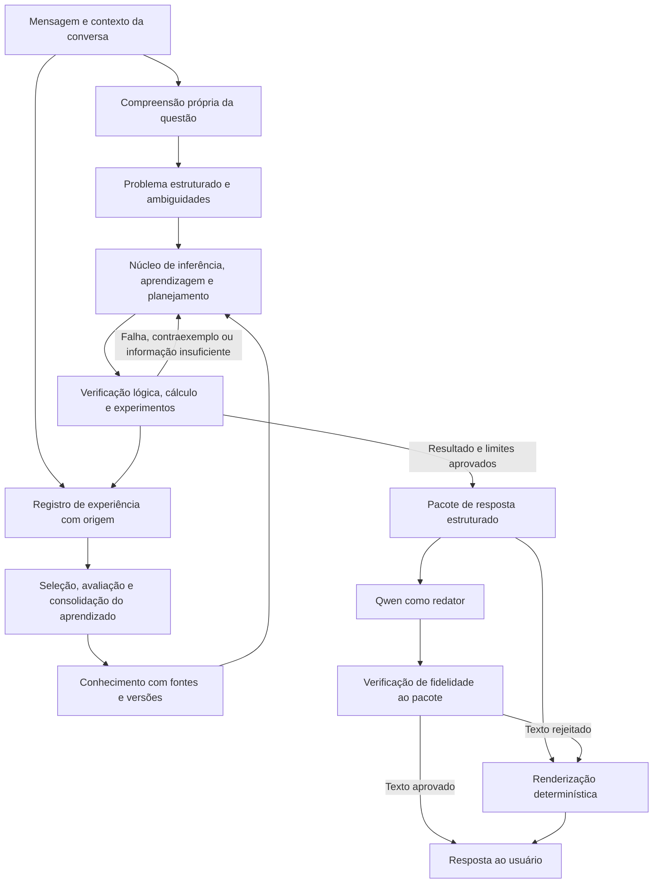

# TODO — Núcleo próprio de raciocínio artificial

Planejamento de pesquisa e desenvolvimento, atualizado em **12/09/2026**. Este documento define a direção pretendida; os itens pendentes não representam capacidades implementadas. Ele passa a ser o backlog principal de evolução do projeto e substitui a ordem de prioridades do roteiro anterior.

## Plano atual para o objetivo completo

**O planejamento anterior era insuficiente para o objetivo amplo.** Os aceites F00–F11 dizem respeito a entregas e experimentos em domínios delimitados. A F12 registrou seis lacunas, mas ainda não as desdobrava num programa de aprendizagem, compreensão e invenção. O [plano do objetivo](docs/OBJECTIVE_PLAN.md) passa a definir capacidades, arquitetura candidata, dados, recursos, riscos de pesquisa, ordem e critérios de avanço. F13–F21 abaixo detalham a execução. Esta revisão de documentos não implementa essas capacidades.

Não há receita ou garantia oferecida para inteligência científica geral, nem medida definida para “1.000 vezes Einstein/Hawking”. Vamos medir ganhos reproduzíveis por tarefa, experiência, custo e validade. Fases concluídas, redes treinadas ou simuladores disponíveis não autorizam anunciar o objetivo final como próximo de concluído.

### Critérios de capacidade independentes dos X de engenharia

| Marco | Evidência necessária para considerá-lo alcançado | Estado amplo atual | Execução |
| --- | --- | --- | --- |
| C01 — Compreensão semântica | Interpretar relações, condições, referentes e metas em conversas reservadas; medir cobertura, erro e esclarecimento | Não demonstrado além do português controlado | F13–F15, F21 |
| C02 — Aprender estruturas | Descobrir regras e variáveis relevantes a partir de observações, além de coeficientes de famílias fornecidas | Não demonstrado | F15–F17 |
| C03 — Transferir e aprender a aprender | Experiência anterior reduzir exemplos/custo em famílias novas frente a cópia sem essa experiência | Não demonstrado | F16, F19 |
| C04 — Aprendizado contínuo | Melhorar em sequência com mudanças não anunciadas, preservar competências e sobreviver a reinício | Não demonstrado fora do piloto delimitado | F15, F19, F21 |
| C05 — Investigar e raciocinar causalmente | Discriminar modelos com observações escolhidas e prever intervenções verificadas | Não demonstrado além de modelos fornecidos | F17, F20 |
| C06 — Inventar algo útil | Produzir artefato ausente dos exemplos, cumprir restrições e superar referência por utilidade verificada | Não demonstrado além da composição limitada | F18, F20–F21 |
| C07 — Chat integrado com competência mais ampla | Acionar capacidades pela linguagem natural, transferir para novos domínios e responder ao problema correto | Não demonstrado fora das coberturas avaliadas | F14–F21 |
| C08 — Contribuir cientificamente | Novidade pertinente, previsão ou artefato útil, confronto com evidência externa e replicação | Não demonstrado | F10-05/07, F20–F21 |

F13 deve registrar métricas, tamanho de avaliação, limiares e orçamento antes de pontuar os novos conjuntos. Um resultado negativo pode encerrar um experimento, mas deixa o marco de capacidade não alcançado. Esses marcos não recebem aprovação por quantidade de testes ou por acordo entre agentes. Os registros e contagens abaixo são históricos; não serão usados como percentual de avanço intelectual.

**Acompanhamento da implementação F01–F11:** os X abaixo correspondem exclusivamente aos itens com **PASS** na [matriz de QA independente](docs/research/F01_F11_QA.md). Itens parciais continuam abertos mesmo quando já possuem código ou relatórios. Os experimentos são válidos nos domínios e orçamentos declarados; a conclusão de uma tarefa de pesquisa pode registrar ausência de vantagem. Consulte também a [validação do fluxo real do chat](docs/CHATBOT_VALIDATION.md).

## Fechamento anterior da retomada — 12/09/2026 às 22:19

**88 de 90 itens aprovados e marcados com X**, após implementação, correções e aceite independente. São 80 PASS e 2 PARCIAIS em F01–F11, mais os oito itens F00. Isso representa conclusão dos requisitos no escopo declarado; não é percentual de inteligência geral ou de descoberta científica.

- O [checkpoint de 08/09](docs/research/CHECKPOINT_F01_F11.md) foi preservado. A retomada partiu de 67 itens aprovados e concluiu **21 itens adicionais**: F02-06, F05-01 a F05-08, F06-08, F07-01 a F07-07, F10-06, F11-04, F11-06 e F11-08.
- **254 testes aprovados:** 119 de cognição, 60 de chat, 40 de ciência e 35 de F00. Cancelamento, falhas de persistência, fontes retiradas e operadores refutados foram corrigidos e retestados. F11-02 recuperou o aceite após as regressões encontradas.
- O QA reproduziu o [piloto cognitivo v4](experiments/cognition/operators-pilot.v4/results.json), e o [parecer científico independente por IA](docs/research/SCIENTIFIC_REVIEW_AI.md) conferiu pressupostos, fontes e contas por métodos independentes. Relatórios científico v7 e aprendizado contínuo v3 têm hashes correspondentes aos fontes finais.
- O [fluxo de aprendizado e invenção](docs/research/COGNITION_OPERATORS.md) foi testado na interface: aprender duas transições, prever uma entrada nova, compor uma sequência, incorporar contraprova e impedir reutilização da solução refutada. O servidor e a aba temporários foram encerrados após a verificação.

**Revisão especializada realizada:** o usuário autorizou um agente especialista em 12/09. O parecer foi elaborado por um agente independente dos autores, com achados tratados e conferidos pelo QA. F10-06/F11-08 receberam aceite nesse escopo de revisão por IA. Não equivale a revisão humana por pares, avaliação cega ou replicação empírica externa.

**Pendências científicas identificadas naquele escopo:**

- **F10-05:** falta demonstrar competência que sustente avançar para um problema científico aberto. O estudo NIST não superou o comparador exigido e a transferência física foi rejeitada. Um novo ciclo precisa de hipótese delimitada, comparador adequado e protocolo registrado antes de pontuar dados novos.
- **F10-07:** falta replicar uma contribuição delimitada com dados, simulador ou medições independentes pertinentes à mesma alegação. Recalcular o mesmo NIST, repartir agregados humanos ou testar uma trajetória de outro domínio não encerra esse requisito.

O teste posterior do usuário expôs uma lacuna de produto que esse fechamento não cobria. Por isso, as duas pendências científicas acima não descrevem todo o trabalho necessário para atingir o objetivo final. Resultados negativos, relatórios anteriores e o conjunto reservado F00 permanecem preservados.

## Correção da conversa natural e ampliação do escopo — 12/09/2026

O relato do usuário foi reproduzido: a recuperação de memória tomava o lugar da interpretação de definições, relações e perguntas. O QA reabriu F02-01/02/04/07, F03-06, F04-08 e F11-05. A correção acrescentou separação entre alvo e referência, decomposição de funções, suposições temporárias, oposição e analogia rastreáveis, composição de conversões por meta e verificação independente antes de persistir hipóteses. Revisões invalidam hipóteses sem apoio; negações, escopo e qualificações causais são preservados.

As evidências desta correção são a [matriz de QA](docs/research/F01_F11_QA.md), o [parecer sobre o raciocínio conversacional](docs/research/CONVERSATIONAL_REASONING_REVIEW.md), a [validação pela interface](docs/CHATBOT_VALIDATION.md) e o [registro conversacional v1](experiments/conversation/conceptual-pilot.v1/results.json). **286 testes de software passaram**, incluindo 31 regressões conceituais. O piloto conhecido registrou 240 verificações em 7 diálogos, sem Qwen. Os pilotos cognitivos v5/v6 e conversacionais v1/v2 preservam suas versões anteriores.

Isso corrige os comportamentos cobertos; não demonstra compreensão aberta, descoberta de qualquer regra ou invenção autônoma. A gramática, os operadores e parte do vocabulário continuam programados. A F12 abaixo explicita trabalho ainda necessário para a experiência pretendida, sem confundir caixas concluídas no laboratório com proximidade percentual ao objetivo geral. Os X de F01–F11 continuam subordinados ao aceite da matriz, e os seis itens novos da F12 permanecem abertos.

**Situação naquele reteste:** os sete aceites reabertos foram restaurados pelo QA. Havia 88 itens com X e oito abertos entre F00–F12: F10-05, F10-07 e F12-01 a F12-06. A revisão posterior acrescentou F13–F21; portanto essa contagem não descreve o plano atual inteiro. O trabalho seguinte começa em F13 e nas dependências de F14–F17, mantendo os critérios científicos de F10.

## 1. Objetivo e definição de sucesso

Construir uma IA que compreenda a questão e o contexto, aprenda com experiências, forme modelos do mundo, proponha explicações e soluções novas, teste suas propostas e revise o que aprendeu. **O processamento da questão, a escolha das premissas, as inferências e a seleção da conclusão devem acontecer no nosso núcleo antes da formulação textual pelo Qwen.**

O Qwen terá a função de redator de conteúdo já determinado. O núcleo deverá funcionar e ser avaliado com esse modelo completamente desligado, incluindo a etapa de compreensão da entrada. Bibliotecas matemáticas, bancos de dados e simuladores podem ser utilizados; sua participação e seus conhecimentos incorporados precisam ser declarados.

A referência a Einstein e Stephen Hawking multiplicados por 1.000 expressa a ambição de descoberta científica e invenção. Ainda não temos uma definição mensurável dessa comparação nem uma receita comprovada para alcançá-la. Vamos avaliar progresso por capacidade de aprender, generalizar, descobrir relações e produzir soluções novas que resistam a verificações independentes. Gerar mil ideias não equivale a gerar mil descobertas válidas.

Aprender com poucos dados depende do domínio, das hipóteses prévias e da informação disponível. Se dois modelos explicam igualmente os exemplos e discordam sobre a próxima situação, a resposta correta pode ser reconhecer a ambiguidade e escolher um novo experimento. A avaliação deverá contabilizar conhecimentos prévios e experiência, como propõe a discussão de [Chollet sobre avaliação da inteligência](https://arxiv.org/abs/1911.01547).

## 2. Ponto de partida histórico no código

A tabela abaixo registra a base anterior à implementação de F01–F11, usada pela auditoria F00. O estado implementado atual está em [CHATBOT_ARCHITECTURE.md](docs/CHATBOT_ARCHITECTURE.md); não deve ser confundido com este inventário histórico.

| Área | O que existe | O que falta para o objetivo |
| --- | --- | --- |
| Conversa | Interface, histórico por conversa, resposta progressiva e modelo local | Fazer o núcleo controlar o significado da resposta e o contexto da tarefa |
| Compreensão | Extração local limitada e extração adicional por modelo em `src/chat/engine.py` e `src/chat/extraction.py` | Compreensão própria, com perguntas, referências, objetivos, quantidades e ambiguidades |
| Memória | SQLite, afirmações, fontes, dependências e revisão em `src/chat/memory.py` | Conceitos, eventos, modelos, experimentos, incerteza quantitativa e regras aprendidas |
| Inferência | Regras explícitas e propostas de oposição, analogia e composição em `src/chat/reasoner.py` | Aprender regras novas, raciocinar causalmente, planejar e testar hipóteses |
| Linguagem | `src/chat/provider.py` permite conhecimento geral do modelo; `engine.py` chama o modelo para responder | Contrato que restrinja o Qwen à verbalização de resultados aprovados |
| Aprendizado | Registro de mensagens e atualização de conhecimento estruturado | Aprendizado de modelos, operadores e estratégias; treinamento de redes próprias |
| Física e quântica | O ciclo atual do chat não possui simulador físico ou módulo quântico integrado | Laboratórios quantitativos com referências, limites e experimentos reproduzíveis |
| Validação | Testes funcionais do chat e roteiro qualitativo com modelo real | Avaliação independente de generalização, contribuição do núcleo e validade de invenções |

Os documentos da fase de pássaros são históricos. Seus percentuais de conclusão e nomes de capacidades não servem como evidência de que o novo núcleo já possui essas capacidades. O estado atual está descrito em [CHATBOT_ARCHITECTURE.md](docs/CHATBOT_ARCHITECTURE.md) e [CHATBOT_VALIDATION.md](docs/CHATBOT_VALIDATION.md).

## 3. Arquitetura a construir

O pacote aprovado deve conter a resposta semântica, conclusões, premissas, fontes, hipóteses, incertezas, cálculos, resultados de testes e eventuais perguntas de esclarecimento. Uma explicação em prosa não substitui um registro verificável de operações e evidências.

**Limite de confiança:** um prompt dizendo “apenas reescreva” não garante fidelidade. O redator pode acrescentar fatos ou mudar uma negação. O modo de pesquisa usa saída determinística; a redação livre só será habilitada nos casos em que pudermos verificar o contrato. Textos do redator não entram automaticamente na memória como evidência.

## 4. Como executar o backlog

- **P0:** necessário para demonstrar independência do núcleo e medir resultados corretamente.
- **P1:** desenvolvimento das capacidades centrais de aprendizagem, raciocínio e invenção.
- **P2:** ampliação de domínio e maturidade operacional.
- **Pesquisa:** abordagem cujo benefício precisa ser testado; pode ser revista ou abandonada conforme os resultados.

As fases organizam dependências, não datas prometidas. Cada item concluído deve apontar para código ou documento, experimento reproduzível e resultado observado. Uma funcionalidade entregue não significa que sua hipótese científica foi confirmada. Cada critério de saída vale para o domínio e conjunto de avaliação declarados.

### F00 — Especificação científica e avaliação inicial · P0

Dependências: nenhuma. Entregáveis: especificação de capacidades, inventário de dependências e protocolo de avaliação.

- [x] **F00-01** Definir operacionalmente compreensão, dedução, indução, analogia, criação, invenção e aprendizado; estabelecer uma tarefa observável e um critério de falha para cada capacidade.
- [x] **F00-02** Auditar código e documentação, classificando cada capacidade como implementada, limitada, planejada ou sem evidência; registrar todas as chamadas a modelos externos e todos os conhecimentos embutidos nas regras.
- [x] **F00-03** Separar quatro níveis de aprendizado: registrar experiência, atualizar crenças, aprender regras/modelos e melhorar estratégias de aprendizagem. Definir quais dados e métricas demonstram cada nível.
- [x] **F00-04** Criar um gerador de pequenos mundos com objetos, ações e regras variáveis. Separar famílias de tarefas para desenvolvimento, validação e teste reservado, com nomes novos e sementes reproduzíveis.
- [x] **F00-05** Registrar as referências de comparação: memória sem inferência, regras atuais, busca simbólica, modelos estatísticos simples, Qwen isolado e núcleo com/sem Qwen. Declarar diferenças de treinamento prévio e oferecer as mesmas evidências de teste.
- [x] **F00-06** Definir antecipadamente métricas, orçamento de exemplos e computação, repetições e critérios de decisão. Dimensionar a avaliação para relatar incerteza e evitar escolher apenas exemplos favoráveis.
- [x] **F00-07** Criar um registro de hipóteses de pesquisa: mecanismo proposto, previsão, alternativa mais simples, experimento que pode refutá-lo e decisão após o resultado.
- [x] **F00-08** Escolher o primeiro domínio quantitativo delimitado e inventariar recursos locais. Usar inicialmente transformações de estados e mecânica simples; registrar dados, ferramentas, competências e custos que faltam.

**Saída:** alguém consegue executar a avaliação inicial, identificar o que veio do Qwen e entender o que exatamente o projeto tentará melhorar.

**Concluída e validada em 08/09/2026.** O agente desenvolvedor entregou os itens; o agente QA independente reproduziu os defeitos, solicitou correções e aprovou o reteste. O [relatório de QA](docs/research/F00_QA.md) registra o aceite de cada item, 35 testes de pesquisa e 57 regressões do chat aprovados. Foram registradas 720 execuções de comparadores em 240 episódios, sem pontuar o conjunto científico reservado. Isso valida a base de avaliação F00. A separação do chatbot e do Qwen foi implementada posteriormente na F01, com seu próprio aceite abaixo.

| Item | Entregável e evidência |
| --- | --- |
| F00-01 | [Definições operacionais, tarefas observáveis e critérios de falha](docs/research/F00_SPEC.md) |
| F00-02 | [Auditoria de capacidades, chamadas a modelos e conhecimentos programados](docs/research/F00_AUDIT.md) |
| F00-03 | [Quatro níveis de aprendizado e respectivas métricas](docs/research/F00_SPEC.md) |
| F00-04 | [Gerador de mundos](src/research/worlds.py), [famílias e isolamento](docs/research/F00_PROTOCOL.md), [testes independentes](tests/research/test_worlds.py) |
| F00-05 | [Registro dos comparadores e de seus limites](docs/research/F00_PROTOCOL.md), [referências executáveis](src/research/baselines.py) |
| F00-06 | [Protocolo anterior aos resultados](experiments/f00/protocol.v1.json), [registro de versão e hashes](experiments/f00/registration.v1.json), [avaliação inicial](docs/research/F00_RESULTS.md) |
| F00-07 | [Hipóteses, condições de refutação e decisões](docs/research/F00_HYPOTHESES.md) |
| F00-08 | [Domínio inicial, recursos locais, orçamento e lacunas](docs/research/F00_RESOURCES.md) |

### F01 — Separação executável entre núcleo e redator · P0

**Evidências da implementação:** [contratos e fluxo executável](docs/CHATBOT_ARCHITECTURE.md), [testes de integração](tests/cognition/test_core_integration.py). Aceite item a item na [matriz de QA](docs/research/F01_F11_QA.md).

Dependências: F00. Entregáveis: contratos de entrada/saída e primeiro fluxo completo com o redator desligado.

- [x] **F01-01** Definir um `ProblemSpec` versionado com intenção, entidades, relações, fatos fornecidos, pergunta, metas, restrições, referências ao contexto e lacunas de informação.
- [x] **F01-02** Definir um `AnswerPackage` versionado com conteúdo aprovado, identificadores de evidência, condições de validade, cálculos, hipóteses e limites. Prever resultados como respondido, ambíguo, desconhecido, contraditório e orçamento esgotado.
- [x] **F01-03** Refatorar o fluxo de `engine.py` para concluir o processamento e a verificação antes de chamar o redator. Retirar do caminho independente a extração pelo Qwen e qualquer delegação de decisões a ele.
- [x] **F01-04** Criar um modo de pesquisa que bloqueie chamadas ao Qwen e a outros modelos gerais em todas as etapas. Começar com entrada estruturada e um subconjunto declarado do português, mantendo o mesmo contrato do núcleo.
- [x] **F01-05** Criar um renderizador determinístico e limitar o adaptador Qwen ao pacote e às instruções de estilo aprovadas. Informações do histórico necessárias à redação devem ser selecionadas pelo núcleo.
- [x] **F01-06** Verificar entidades, números, unidades, fórmulas, negações, fontes e grau de certeza após a redação. Onde não houver verificação semântica confiável, usar a saída determinística; a aprovação pelo próprio Qwen não basta.
- [x] **F01-07** Impedir a exibição de afirmações ainda não aprovadas durante o streaming. Separar progresso do processamento de conteúdo final; testar falha, indisponibilidade e alteração indevida pelo redator.

**Saída:** uma tarefa do domínio inicial produz o mesmo conteúdo semântico com Qwen ligado, desligado ou substituído. O registro mostra que o pacote já estava concluído antes da chamada de redação.

### F02 — Compreensão própria da pergunta e do contexto · P0 → P1

**Evidências da implementação:** [processador próprio](src/cognition/processor.py), [testes de contexto e pares mínimos](tests/cognition/test_processor.py). Aceite item a item na [matriz de QA](docs/research/F01_F11_QA.md).

Dependências: F01. Entregáveis: processador de linguagem próprio e conjunto anotado de conversas.

- [x] **F02-01** Construir um analisador que diferencie pergunta, afirmação, correção, hipótese, pedido de criação e restrição de formato; preservar negações, quantificadores e condições.
- [x] **F02-02** Representar o estado da conversa: assunto, objetivo ativo, entidades, referências como “isso” e “a última resposta”, mudanças de assunto e informações ainda pendentes.
- [x] **F02-03** Extrair números, unidades, intervalos, variáveis, equações, eventos e relações temporais; detectar incompatibilidades de tipo e unidade já na entrada.
- [x] **F02-04** Tratar ambiguidades explicitamente: manter interpretações candidatas ou formular uma pergunta específica. Não preencher silenciosamente lacunas com conhecimento do redator.
- [x] **F02-05** Criar dados de treino e avaliação com paráfrases, erros de digitação, elipses e conversas com múltiplos assuntos; manter a interpretação estruturada esperada como referência.
- [x] **F02-06** Evoluir da gramática inicial para modelos neurais próprios de compreensão, com arquitetura, dados, pesos e treinamento documentados. Medir cobertura antes de ampliar o português aberto; dados sintéticos de outro modelo exigem procedência e avaliação separada.
- [x] **F02-07** Testar alterações mínimas que mudam a resposta: entidade, valor, negação, tempo e objetivo. Incluir perguntas com palavras parecidas e significados diferentes, além de assuntos sem relação com os exemplos originais.

**Saída:** no escopo declarado, a última mensagem e o contexto correto determinam o problema estruturado. Entradas fora desse escopo geram esclarecimento ou limitação explícita, com taxa de erro medida.

**Alcance do aceite:** gramática e cobertura avaliadas. A saída de compreensão ampla C01 permanece não demonstrada; a rede experimental de intenção não equivale a um modelo semântico completo.

### F03 — Representação do conhecimento e memória revisável · P0 → P1

**Evidências da implementação:** [memória tipada e revisão](src/cognition/store.py), [migração e governança](docs/research/MEMORY_LEARNING_OPERATIONS.md). Aceite item a item na [matriz de QA](docs/research/F01_F11_QA.md).

Dependências: F01; pode avançar junto de F02. Entregáveis: modelo de conhecimento e migração da memória.

- [x] **F03-01** Ampliar triplas para estruturas tipadas: entidades, atributos, relações com múltiplos argumentos, eventos, estados, regras condicionais, equações, ações e objetivos.
- [x] **F03-02** Distinguir memória de episódios, conhecimento conceitual, procedimentos aprendidos, modelos do mundo e experimentos; conectar cada item à experiência que o originou.
- [x] **F03-03** Registrar fonte, data, escopo, versão, hipótese de domínio e forma de obtenção. Separar afirmação do usuário, resultado observado, dedução condicional e hipótese do motor.
- [x] **F03-04** Representar desconhecimento, conflito e incerteza. Separar confiança na extração, credibilidade da fonte, probabilidade de um evento e validade de uma derivação; evitar um número único sem interpretação.
- [x] **F03-05** Ampliar revisão de crenças e invalidação de dependências para regras, modelos e planos. Mudanças de contexto ou tempo não devem ser tratadas automaticamente como contradições.
- [x] **F03-06** Recuperar conhecimento por significado, estrutura e objetivo, preservando a origem. Se houver embeddings, declarar seu treinamento e testar se a busca encontra a premissa necessária sem confundir similaridade com evidência.
- [x] **F03-07** Definir escopos de conhecimento da conversa, do usuário e do laboratório. Criar migração com backup, exportação e retirada de dados, preservando as conversas existentes.

**Saída:** toda conclusão pode ser ligada às premissas utilizadas; corrigir uma premissa retira ou reavalia suas consequências, inclusive planos e modelos afetados.

### F04 — Mecanismos próprios de raciocínio · P1

**Evidências da implementação:** [operadores e verificadores](src/cognition/reasoning.py), [testes adversos](tests/cognition/test_reasoning.py). Aceite item a item na [matriz de QA](docs/research/F01_F11_QA.md).

Dependências: F02 no domínio inicial e F03. Entregáveis: operadores de inferência, busca e verificação.

- [x] **F04-01** Implementar dedução com variáveis, tipos, condições e composição de regras. Gerar uma derivação que um verificador separado possa conferir.
- [x] **F04-02** Implementar indução de regras candidatas a partir de exemplos e contraexemplos; comparar alternativas por previsão, complexidade e compatibilidade com os dados.
- [x] **F04-03** Implementar abdução: propor explicações para uma observação, listar alternativas e indicar quais evidências as distinguem.
- [x] **F04-04** Implementar analogia por correspondência entre estruturas e papéis, com pré-condições para transferir relações. Medir também transferências incorretas entre domínios.
- [x] **F04-05** Representar modelos causais, intervenções e perguntas contrafactuais; declarar hipóteses necessárias e reconhecer efeitos que não podem ser identificados com os dados disponíveis.
- [x] **F04-06** Criar planejamento por estados, ações, pré-condições, efeitos e restrições. Buscar sequências verificáveis para atingir uma meta, incluindo caminhos que falham.
- [x] **F04-07** Controlar a busca por custo, tempo, memória e utilidade esperada; detectar ciclos, conclusões repetidas e contradições. Encerrar com resultado parcial explícito quando necessário.
- [x] **F04-08** Distinguir conclusão demonstrada, previsão dependente de modelo e hipótese exploratória. Tratar oposição como um gerador possível de hipóteses: a existência de uma propriedade não prova a existência de seu contrário.

**Saída:** o núcleo resolve tarefas novas de composição e explica suas dependências, reconhece casos indeterminados e rejeita inferências inválidas. O tratamento causal se apoia em pressupostos explícitos, conforme o formalismo de [Pearl](https://ftp.cs.ucla.edu/pub/stat_ser/r350.pdf).

### F05 — Redes neurais próprias e aprendizado com poucos exemplos · P1 / Pesquisa

**Evidências da implementação:** [redes e operadores próprios](docs/research/COGNITION_OPERATORS.md), [experimentos e resultados de generalização](docs/research/COGNITION_RESULTS.md). Aceite item a item na [matriz de QA](docs/research/F01_F11_QA.md).

Dependências: F00, F03 e F04. Entregáveis: primeiro modelo treinado pelo projeto e relatório de generalização.

- [x] **F05-01** Selecionar uma primeira função neural delimitada, como prever transições ou ordenar hipóteses. Definir entradas, alvos, função de perda e comparação com soluções sem rede neural.
- [x] **F05-02** Treinar um modelo pequeno com pesos inicializados pelo projeto. Registrar arquitetura, dados, sementes, versões, curvas de aprendizagem e uso de recursos; distinguir regras programadas de relações aprendidas.
- [x] **F05-03** Aprender operadores reutilizáveis a partir de transições observadas, com condições de aplicação. Avaliar combinações que não foram mostradas nos exemplos.
- [x] **F05-04** Medir adaptação com diferentes quantidades de exemplos e com ruído. Contabilizar todo treinamento anterior, inclusive metatreinamento; “um exemplo novo” não significa ausência de experiência prévia.
- [x] **F05-05** Integrar propostas neurais ao verificador lógico ou físico. A rede poderá sugerir candidatos; validade e grau de apoio precisam de critérios independentes da sua pontuação.
- [x] **F05-06** Pesquisar aprendizagem de representações, abstrações e estratégias reutilizáveis entre famílias de tarefas. Avaliar generalização para regras e estruturas novas, além de renomear objetos conhecidos.
- [x] **F05-07** Implementar escolha ativa de exemplos ou experimentos para reduzir incerteza. Comparar o ganho obtido por consulta com seleção aleatória e heurísticas simples.
- [x] **F05-08** Fazer experimentos retirando memória, rede, busca e verificador, um componente por vez. Manter cada componente quando houver benefício demonstrado ou uma função operacional claramente necessária.

**Saída:** o núcleo melhora em tarefas reservadas após aprender, com Qwen ausente; o relatório distingue memorização, composição de regras fornecidas e aprendizagem de uma regra que não estava programada. Modelos causais, composicionalidade e aprender a aprender são direções de pesquisa discutidas por [Lake e colaboradores](https://arxiv.org/abs/1604.00289), sem constituírem garantia de inteligência geral.

**Alcance do aceite:** o experimento numérico está entregue; estruturas, bases e famílias foram fornecidas e cada ajuste reinicializou seus pesos. Isso não alcança C02/C03. O resultado sem vantagem de seleção ativa não alcança C05. As capacidades amplas desta saída dependem dos novos marcos, mesmo com os experimentos acima concluídos.

### F06 — Física como modelo do mundo e verificação de hipóteses · P1 / Pesquisa

**Evidências da implementação:** [contratos físicos](docs/research/SCIENCE_PROTOCOL.md), [resultados observados](docs/research/SCIENCE_RESULTS.md). Aceite item a item na [matriz de QA](docs/research/F01_F11_QA.md).

Dependências: F03 e F04; comparação neural depende de F05. Entregáveis: laboratório físico limitado, modelos e testes de referência.

- [x] **F06-01** Construir ambientes iniciais de movimento, forças, colisões ou circuitos simples, escolhendo um por vez. Definir variáveis, unidades, condições iniciais, ações disponíveis e resultados observáveis.
- [x] **F06-02** Implementar análise dimensional e restrições físicas com domínio de validade. Leis de conservação devem considerar fronteiras, forças externas, dissipação e hipóteses do modelo.
- [x] **F06-03** Validar simuladores contra soluções analíticas ou implementações independentes; medir erro numérico, estabilidade e sensibilidade. Não validar uma previsão apenas com a mesma rotina que a gerou.
- [x] **F06-04** Aprender parâmetros e modelos de dinâmica a partir de observações, incluindo ruído e variáveis parcialmente observadas. Avaliar previsões em condições não usadas no ajuste.
- [x] **F06-05** Criar busca de equações por regressão simbólica, usando unidades, simetrias e simplicidade como restrições declaradas. Manter leis fornecidas para verificação separadas das leis que o experimento pretende descobrir.
- [x] **F06-06** Comparar redes com restrições físicas, modelos sem essas restrições e métodos numéricos tradicionais. Medir precisão, dados necessários, custo e falhas fora do domínio.
- [x] **F06-07** Permitir ao núcleo formular um experimento físico simulado, prever resultados, executar o teste e revisar o modelo. Armazenar também previsões refutadas e suas causas.
- [x] **F06-08** Transferir modelos para dados medidos e problemas maiores somente após avaliar diferença entre simulação e realidade. Registrar quando uma hipótese sugere falha do modelo vigente, em vez de declarar uma nova lei automaticamente.

**Saída:** um modelo aprendido prevê novos resultados e uma hipótese inadequada é rejeitada por teste independente. Usar física significa representar mecanismos e restrições verificáveis. [AI Feynman](https://arxiv.org/abs/1905.11481) oferece uma referência de descoberta de expressões em tarefas delimitadas; [Physics-informed machine learning](https://www.nature.com/articles/s42254-021-00314-5) fundamenta a comparação entre aprendizado e conhecimento físico incorporado.

### F07 — Inovação e invenção orientadas a objetivos · P1 / Pesquisa

**Evidências da implementação:** [composição de operadores e artefatos executáveis](docs/research/COGNITION_OPERATORS.md), [ablações e fluxo de contraprovas](docs/research/COGNITION_RESULTS.md). Aceite item a item na [matriz de QA](docs/research/F01_F11_QA.md).

Dependências: F04, F05 e primeiro laboratório de F06. Entregáveis: gerador de soluções testáveis e protocolo de seleção.

- [x] **F07-01** Representar pedidos de invenção como metas mensuráveis, recursos, restrições, orçamento e critérios de sucesso. Exigir clareza sobre o problema que a proposta pretende resolver.
- [x] **F07-02** Gerar candidatos por composição, abstração, analogia estrutural, mudança de premissas e busca de programas ou projetos. Registrar qual transformação originou cada candidato.
- [x] **F07-03** Produzir artefatos verificáveis: plano de ações, expressão matemática, programa ou especificação de um mecanismo. A descrição textual deverá derivar desse artefato.
- [x] **F07-04** Avaliar utilidade, viabilidade, novidade, robustez e custo separadamente. Comparar com soluções conhecidas e medir ganhos após considerar os recursos consumidos.
- [x] **F07-05** Criar o ciclo propor → prever → testar → analisar falha → revisar. Dedicar parte do orçamento à busca de contraexemplos e casos extremos.
- [x] **F07-06** Medir diversidade real de mecanismos e eliminar paráfrases da mesma ideia. Escolher experimentos que diferenciem candidatos, evitando maximizar apenas o número de propostas.
- [x] **F07-07** Incorporar resultados negativos e condições de falha à memória de procedimentos. Testar transferência para novos problemas sem repetir um erro já identificado.

**Saída:** o sistema entrega uma solução que cumpre uma meta inédita no ambiente reservado, com avaliação independente e comparação explícita. Ser nova para o sistema ainda não prova que seja nova para a ciência.

**Alcance do aceite:** composição em linguagens e funções fornecidas. A capacidade ampla de invenção útil C06 não está demonstrada pelo programa afim ou pela cadeia simbólica; exige mecanismos, restrições e validação no novo domínio.

### F08 — Mecânica quântica e modelos de cognição quântica · Pesquisa

**Evidências da implementação:** [protocolo e equações](docs/research/SCIENCE_PROTOCOL.md), [resultados, inclusive negativos](docs/research/SCIENCE_RESULTS.md). Aceite item a item na [matriz de QA](docs/research/F01_F11_QA.md).

Dependências: F00 e contratos de F01; integração com raciocínio e física depende de F04/F06. Entregáveis: experimentos separados, com relatório favorável ou desfavorável.

A frente quântica integra o programa de pesquisa, com três perguntas distintas:

| Linha | O que testar | O que um resultado positivo permite afirmar |
| --- | --- | --- |
| Mecânica quântica como domínio físico | Aprender e prever sistemas quânticos pequenos | Competência no domínio estudado |
| Formalismo quântico aplicado à cognição | Representar contexto e ordem da informação e comparar modelos | Melhor ajuste ou previsão em tarefas específicas |
| Computação quântica como recurso | Executar um algoritmo adequado e comparar custo total | Vantagem na tarefa e condições medidas |

Modelos de cognição quântica utilizam um formalismo matemático que, em geral, não pressupõe um cérebro fisicamente quântico. Essa distinção está explícita no tutorial de [Yearsley e Busemeyer](https://jbusemey.pages.iu.edu/quantum/YearselyBusemeyerJMP.pdf). Aplicar esse formalismo ao nosso núcleo é uma hipótese de pesquisa; não demonstra, por si só, raciocínio humano ou criatividade superior.

- [x] **F08-01** Especificar o papel de cada conceito quântico proposto em equações e operações executáveis. Evitar usar “superposição”, “emaranhamento” ou “colapso” apenas como nomes para listas, associações ou escolha de resposta.
- [x] **F08-02** Criar um laboratório clássico de simulação de sistemas quânticos pequenos: estados, observáveis, evolução e medição. Começar por casos com solução conhecida, como um sistema de dois níveis.
- [x] **F08-03** Validar normalização, probabilidades de Born e evolução unitária quando aplicável; testar resultados analíticos e contabilizar erro numérico. Modelos abertos ou com ruído exigem hipóteses e verificações próprias.
- [x] **F08-04** Avaliar se o núcleo aprende parâmetros, distingue modelos candidatos e escolhe medições informativas nesse laboratório. Separar previsões aprendidas de resultados fornecidos pelo simulador.
- [x] **F08-05** Implementar um experimento de cognição quântica sobre efeitos de contexto ou ordem, usando dados adequados. Comparar com modelos clássicos que também representem contexto, com complexidade e orçamento comparáveis.
- [x] **F08-06** Testar separadamente se o mecanismo melhora resolução lógica ou invenção. Reproduzir um efeito de decisão humana não implica raciocinar melhor; medir erros e sensibilidade à ordem quando ela deveria ser irrelevante.
- [x] **F08-07** Medir custo de simulação antes de aumentar o espaço de estados. A representação densa de um vetor de estado de n qubits contém 2ⁿ amplitudes; investigar aproximações apenas onde sejam válidas e documentar o erro introduzido.
- [x] **F08-08** Avaliar hardware quântico somente se houver algoritmo e caso de uso que justifiquem o experimento, incluindo preparação, leitura, ruído e custo. Registrar a decisão de integrar, reformular ou encerrar cada hipótese, mesmo quando não houver vantagem.

**Saída:** cada linha tem resultados reproduzíveis e uma conclusão proporcional à evidência. Simulação em computador clássico é suficiente para iniciar; a necessidade de hardware quântico permanece uma decisão experimental. O custo da representação densa está documentado no [Qiskit Aer](https://qiskit.github.io/qiskit-aer/stubs/qiskit_aer.StatevectorSimulator.html).

### F09 — Aprendizado contínuo com estabilidade · P1

**Evidências da implementação:** [controlador de aprendizado](src/cognition/learning.py), [piloto de retenção e reversão](docs/research/MEMORY_LEARNING_OPERATIONS.md). Aceite item a item na [matriz de QA](docs/research/F01_F11_QA.md).

Dependências: F03 e F05. Entregáveis: ciclo de consolidação, avaliação e reversão de aprendizado.

- [x] **F09-01** Transformar cada interação em experiência classificada: pergunta, informação, correção, preferência, resultado de teste ou exemplo de tarefa. Nem toda mensagem contém conhecimento factual novo.
- [x] **F09-02** Separar atualização imediata de contexto e memória da consolidação de regras e treinamento de pesos. Definir os eventos que acionam cada processo e como seu efeito será medido.
- [x] **F09-03** Selecionar dados de treinamento pela origem, qualidade e relevância; impedir que respostas geradas ou repetição de uma alegação sejam usadas como confirmação independente.
- [x] **F09-04** Avaliar mecanismos para conservar capacidades anteriores, incluindo repetição de experiências selecionadas e modularização. Medir esquecimento, interferência e adaptação a mudanças reais do domínio.
- [x] **F09-05** Versionar conjuntos de dados, memória, regras e pesos; avaliar uma versão candidata antes de adotá-la e oferecer reversão reproduzível.
- [x] **F09-06** Testar ensinamentos incorretos, fontes conflitantes e correções posteriores. Mensagens e documentos ingeridos não devem alterar permissões, verificadores ou critérios de avaliação.
- [x] **F09-07** Planejar exclusão de dados e remoção de sua influência. Distinguir apagar mensagens, invalidar conhecimento e retirar informação incorporada aos pesos; avaliar retreinamento quando necessário.

**Saída:** experiências novas trazem ganho medido sem perda inaceitável nas capacidades anteriores; é possível identificar o que mudou, por quê e como retornar à versão anterior.

**Alcance do aceite:** piloto linear/modular com identidade de tarefa e mudanças de domínio fornecidas. A capacidade ampla C04 exige seleção e adaptação em sequência sem essas indicações, conforme F19; a saída acima não decorre automaticamente da persistência ou dos X do experimento.

### F10 — Da solução de laboratório à descoberta científica · P2 / Pesquisa

**Evidências da implementação:** [dossiê e fontes](docs/research/SCIENCE_DISCOVERY.md), [lacunas de validação externa](docs/research/SCIENCE_STATUS.md). Aceite item a item na [matriz de QA](docs/research/F01_F11_QA.md).

Dependências: F06, F07 e aprendizado controlado de F09; F08 quando o domínio exigir. Entregáveis: dossiês de descoberta e replicação independente.

- [x] **F10-01** Escolher um problema científico ou de engenharia delimitado com dados confiáveis, referência de comparação e verificação acessível. Definir quais resultados teriam utilidade real.
- [x] **F10-02** Criar aquisição de conhecimento de artigos, conjuntos de dados e experimentos, com procedência, licenças, unidades, condições e incertezas; validar a interpretação antes de incorporá-la ao núcleo.
- [x] **F10-03** Implantar busca de trabalhos e soluções anteriores. Classificar novidade para o sistema, novidade no conjunto estudado e possível novidade científica; registrar o alcance da busca, sem tratá-la como prova de inexistência anterior.
- [x] **F10-04** Começar por redescobertas controladas, ocultando do aprendiz a relação que deve encontrar. Impedir acesso à resposta por nomes, metadados, regras do verificador ou documentos usados no treino.
- [ ] **F10-05** Passar a problemas abertos apenas após demonstrar competência nas referências anteriores. Produzir previsões discriminantes e condições de refutação para cada proposta.
- [x] **F10-06** Preparar um dossiê com dados, hipóteses, método, artefato, resultados, comparações, limitações e passos de reprodução. Avaliar novidade e utilidade com especialistas sem revelar a origem das propostas quando viável.
- [ ] **F10-07** Replicar resultados com dados, simuladores ou medições independentes; registrar resultados negativos. Uma melhoria simulada só pode ser anunciada como melhoria real após validação adequada ao domínio.

**Saída:** uma contribuição tem utilidade demonstrada, avaliação de trabalhos anteriores e reprodução independente. Aumentar o número de domínios ou a autonomia depende da repetição desse resultado, não da fluência do chat.

### F11 — Engenharia, recursos e uso do laboratório · P0 transversal → P2

**Evidências da implementação:** [operação, recursos e limites](docs/research/MEMORY_LEARNING_OPERATIONS.md), [API e interface](src/chat/server.py). Aceite item a item na [matriz de QA](docs/research/F01_F11_QA.md).

Dependências: começa em F00; acompanha todas as fases. Entregáveis: infraestrutura reproduzível, dados migráveis e interface que apresenta evidências.

- [x] **F11-01** Isolar dados de experimento das conversas pessoais; criar migrações versionadas, backups verificáveis e restauração testada antes das alterações de esquema.
- [x] **F11-02** Retirar cálculo, simulação e chamadas demoradas de transações longas do banco; implementar cancelamento, limites de execução, filas quando necessárias e recuperação após falha.
- [x] **F11-03** Executar programas e experimentos gerados em ambiente isolado, com acesso e recursos limitados. Novos operadores passam por avaliação antes de poderem atuar no sistema principal.
- [x] **F11-04** Registrar tempos de compreensão, busca, teste e redação, consumo de memória e custo por solução válida. Começar com experiências pequenas no hardware local e dimensionar recursos a partir de medições.
- [x] **F11-05** Criar uma interface de evidências com fontes, condições, incertezas, revisões e experimentos. O chat deve continuar respondendo à mensagem atual; detalhes técnicos ficam acessíveis quando ajudam a avaliar a resposta.
- [x] **F11-06** Separar testes de software, avaliações de modelos e experimentos científicos. Automatizar a reprodução com configuração, sementes, versões e relatórios, incluindo falhas e resultados negativos.
- [x] **F11-07** Planejar privacidade e escopo de compartilhamento antes de múltiplos usuários ou serviços externos; definir exportação, exclusão e quais conversas podem participar de treinamento.
- [x] **F11-08** Atribuir responsável por frente e registrar competências necessárias: engenharia, aprendizado de máquina, lógica, estatística e física; buscar revisão especializada para afirmações quânticas e científicas. Estimar esforço após o primeiro experimento de cada frente.

**Saída:** os resultados são reproduzíveis, a aplicação pode ser recuperada após falhas e o custo para obter cada melhoria é conhecido.

### F12 — Compreensão e descoberta além dos operadores fornecidos · P1 → Pesquisa

Dependências: integrar os resultados de F02–F09 e a correção conversacional; avançar por experimentos delimitados. Esta fase amplia o escopo a partir da falha real de uso. Seus itens não estão concluídos pelas regressões da F01–F11.

- [ ] **F12-01** Ampliar a compreensão própria para paráfrases, elipses, negações e restrições combinadas fora das gramáticas atuais, usando corpus independente, cobertura medida e comparação com o analisador existente; incluir conversas longas e mudanças de assunto.
- [ ] **F12-02** Aprender relações e regras candidatas a partir de observações, sem o usuário precisar fornecer a regra final. Comparar mecanismos alternativos e medir transferência para estruturas novas, separando indução de coeficientes de descoberta de regras relacionais.
- [ ] **F12-03** Gerar, comparar e selecionar múltiplas hipóteses explicativas e projetos sob metas e restrições, com ranking testável de utilidade, diversidade e incerteza. Superar a simples aplicação de oposição, similaridade e encadeamento de funções fornecidas.
- [ ] **F12-04** Integrar aquisição de conhecimento com procedência e modelos causais verificáveis: distinguir fontes, observações, afirmações, suposições e conflitos; representar mecanismos, perdas, interfaces e compatibilidade física antes de aprovar uma invenção aplicável.
- [ ] **F12-05** Fechar o ciclo de pergunta, experimento, resultado e revisão nas conversas; escolher observações que distingam hipóteses e demonstrar melhoria em problemas posteriores, com controle de esquecimento e separação entre memória de episódios e treinamento.
- [ ] **F12-06** Registrar avaliação independente em famílias de tarefas e conversas ainda não usadas no desenvolvimento. Comparar memória, regras programadas e aprendizes com informação e orçamento declarados; medir competência antes de ampliar o domínio ou atribuir superioridade científica.

**Saída:** comportamento conversacional mais amplo sustentado por ganhos medidos em problemas novos, com a contribuição do aprendizado separada da dos operadores fornecidos. Essa fase não promete equivalência ao raciocínio humano ou vantagem quântica.

### Desdobramento da F12 — F13 a F21

F12 mantém os requisitos abrangentes. As fases seguintes são suas entregas executáveis, não capacidades adicionais para somar numa porcentagem. Mapeamento: F12-01 → F14/F21; F12-02 → F15/F16; F12-03 → F17/F18; F12-04 → F15/F20; F12-05 → F17/F19; F12-06 → F13/F21. Encerrar um filho não encerra automaticamente o requisito abrangente.

As técnicas candidatas abaixo podem ser substituídas ou descartadas por comparação experimental documentada. Bibliotecas aprendidas, políticas neurais ou modelos latentes não são condições universais para inteligência. O aceite de C01–C08 depende da capacidade observada e da contribuição do aprendizado; uma técnica rejeitada encerra apenas sua investigação, não a capacidade que ela pretendia fornecer.

### F13 — Contrato de capacidade, dados reservados e viabilidade · P0

Tipo: engenharia de avaliação. Dependências: auditoria atual. Responsáveis necessários: integração, QA e estatística; objetivos de domínio revisados por especialista.

- [ ] **F13-01** Registrar o contrato de C01–C08 e do primeiro marco M1: tarefas, domínio, conhecimento prévio, custo, limites e critérios de falha. Definir limiares de ganho, cobertura, erro, retenção e utilidade antes de pontuar dados novos.
- [ ] **F13-02** Criar conjuntos independentes de desenvolvimento, seleção e avaliação por família, estrutura, template, autor e fonte. Isolar e auditar acessos ao mecanismo oculto, aos gabaritos e às respostas do avaliador; entregar ao aprendiz somente observações permitidas. Congelar o candidato antes de revelar o teste; preservar o reservado F00 e classificar testes já vistos como regressão.
- [ ] **F13-03** Implementar comparações com memória, regras fixas, aprendiz simples e versões sem cada componente aprendido. Igualar informação/orçamento pertinente, contabilizar treino prévio e estabelecer amostragem e incerteza por unidade independente.
- [ ] **F13-04** Medir treinamento e inferência de candidatos pequenos no hardware disponível; estimar anotação, armazenamento, computação e esforço humano a partir de curvas de custo/ganho. Registrar orçamento de interrupção e decisão de escala, sem compras presumidas.
- [ ] **F13-05** Criar o registro de capacidade separado do QA de software, com versões, domínio, responsável, resultado, contraprovas e decisão. Registrar também pesquisa refutada e riscos ainda sem método demonstrado.

**Aceite:** avaliação reproduzível e viável, registrada antes de observar o teste novo. Não concede, por si só, nenhum dos marcos C01–C08.

### F14 — Dados e compreensão semântica aprendida · P1

Tipo: engenharia de dados/treino e pesquisa de generalização. Dependências: F13. Responsáveis: linguagem, aprendizagem e QA.

- [ ] **F14-01** Montar corpus com procedência e direitos de uso: português natural, relações, referências, quantificação, condições, hipóteses, metas e correções. Incluir anotação independente e medir divergência entre anotadores.
- [ ] **F14-02** Construir a cadeia própria de tokenização, representações, modelo, objetivos, otimização e checkpoints. Declarar o que foi inicializado do zero, o que veio de bibliotecas e toda experiência prévia; Qwen não fornece decisões semânticas.
- [ ] **F14-03** Treinar o processamento completo mensagem/contexto → interpretações estruturadas, com entidades, relações, condições e metas. Classificar intenções isoladamente não satisfaz este item.
- [ ] **F14-04** Representar interpretações concorrentes e decidir entre responder, pedir esclarecimento ou buscar observação. Calibrar essa decisão e impedir aprovação por abstenção generalizada.
- [ ] **F14-05** Avaliar estruturas, autores, assuntos e conversas longas fora do treino, incluindo contexto irrelevante, paráfrases e erros. Medir efeito do modelo versus gramática, modelo sem treino e referências simples.
- [ ] **F14-06** Integrar o candidato aprovado ao ProblemSpec e ao chat; testar sem Qwen, verificar condições/negações e reverter versões que piorem a semântica. Preservar limites explicitamente quando não houver ganho.

**Aceite:** ganho de interpretação e resposta no contrato C01, sem fornecer ao usuário a gramática interna. Compreensão aberta além desse contrato continua pesquisa.

### F15 — Conhecimento com procedência e modelos do mundo · P1

Tipo: engenharia e pesquisa de representação. Dependências: F13; integração linguística com F14. Responsáveis: representação, dados e domínio.

- [ ] **F15-01** Representar entidades, classes, papéis, propriedades, estados, eventos, ações, tempo, unidades e condições, ligando texto e observações a estruturas revisáveis; distinguir tipo, instância e contexto hipotético.
- [ ] **F15-02** Construir ingestão de material selecionado e observações com fonte, versão, unidade e qualidade. Diferenciar conhecimento documentado de afirmação humana e hipótese gerada; medir extração e recuperação pertinentes.
- [ ] **F15-03** Tratar identidade de conceitos, sinônimos, exceções, contradições e dependências; impedir que repetição ou fontes derivadas contem como confirmação independente.
- [ ] **F15-04** Aprender representações de estado e transição que prevejam consequências de ações. Registrar observabilidade, ruído e variáveis desconhecidas; comparar modelo aprendido com representações fornecidas.
- [ ] **F15-05** Validar previsões e revisões em estados e contextos novos, inclusive retirada de fontes. Medir mudança de capacidade além da qualidade de recuperação da memória.

**Aceite:** conhecimento e modelos utilizáveis em inferência verificada; possuir um grafo ou vetor não basta. Modelos causais aprendidos exigem também F17.

### F16 — Indução de estrutura, abstrações e transferência · Pesquisa/P1

Dependências: F13/F15; F14 para aceite pelo chat. Responsáveis: aprendizagem, síntese de programas e lógica.

Sequência interna: F16-01 a F16-05 fornecem candidatos e abstrações à F17; os experimentos discriminantes de F17 retornam evidência. Só depois dessa integração F16-06 pode encerrar M1. O ciclo de investigação não implica que o marco esteja concluído antes da F17.

- [ ] **F16-01** Definir linguagem inicial de hipóteses com relações, condições, variáveis e procedimentos; inventariar todos os recursos fornecidos. Não colocar as respostas reservadas na gramática.
- [ ] **F16-02** Implementar candidatos que alterem estrutura e variáveis relevantes a partir de observações, além de ajustar coeficientes; detectar evidências de inadequação da classe, manter alternativas quando não houver identificação e revisar/ampliar a classe quando justificado.
- [ ] **F16-03** Aprender abstrações e subprocedimentos reutilizáveis, com evidências e versões, separando biblioteca fornecida de biblioteca descoberta. Medir reutilização e diversidade funcional.
- [ ] **F16-04** Aprender uma proposta de busca ou seleção de hipóteses a partir de experiência, mantendo execução/verificação separadas e orçamento definido. Comparar com busca e heurísticas fixas.
- [ ] **F16-05** Demonstrar transferência entre famílias: comparar estado experiente, cópia sem experiência e controle simples com os mesmos novos exemplos. Contar metatreino e medir transferência negativa.
- [ ] **F16-06** Executar M1 sem entregar a regra final, com ruído, ambiguidade e contraprova; exigir modelo persistente, previsão nova e plano verificado pelo chat. Registrar falha se o ganho depender de acrescentar manualmente a regra de cada tarefa.

**Aceite:** C02/C03 somente após ganho causado pelo aprendizado em estruturas novas. Não há garantia de que o método inicial alcance essa condição.

### F17 — Causalidade, hipóteses concorrentes e experimentação ativa · Pesquisa/P1

Dependências: F13/F15 e candidatos da F16. Responsáveis: causalidade, aprendizagem ativa e domínio.

- [ ] **F17-01** Manter explicações concorrentes com pressupostos, previsões, suporte e incerteza. Diferenciar conclusão lógica, indução, analogia e especulação, sem confiança numérica arbitrária.
- [ ] **F17-02** Criar tarefas em que observação e intervenção tenham resultados diferentes e em que modelos sejam indistinguíveis sem informação adicional. Registrar limites de identificação e contrafactuais não sustentados.
- [ ] **F17-03** Escolher perguntas ou experimentos por valor informativo e custo, num domínio onde a escolha realmente importe. Comparar com seleção aleatória, fixa e referência informativa pertinente.
- [ ] **F17-04** Incorporar resultados independentes, atualizar/rejeitar modelos e buscar contraexemplos. Feedback textual positivo não é confirmação automática de funcionamento.
- [ ] **F17-05** Medir previsão de intervenções e ganho por observação em famílias reservadas; avaliar quando é correto não concluir e quando o sistema deve investigar mais.

**Aceite:** C05 depende de observações discriminantes e previsões verificadas; consultar mais dados sem melhorar a decisão não encerra a capacidade.

### F18 — Projetos e invenções com função verificável · Pesquisa/P1

Dependências: F15–F17; F20 para artefatos físicos. Responsáveis: planejamento/síntese, domínio e QA independente.

- [ ] **F18-01** Transformar pedidos naturais em objetivo, recursos, restrições, interfaces, custo e função de utilidade verificável. Pedir a informação que faltar sem exigir do usuário uma receita da solução.
- [ ] **F18-02** Gerar candidatos por programas, abstrações aprendidas, analogia estrutural e alteração de mecanismo; medir diversidade funcional em vez de quantidade de frases.
- [ ] **F18-03** Produzir artefatos executáveis ou especificações testáveis; prever consumo, perdas, compatibilidade e falhas. Nomear um dispositivo não conta como implementá-lo.
- [ ] **F18-04** Executar, analisar falhas e revisar candidatos contra referência independente, com condições de teste reservadas dentro da especificação fornecida e testes de robustez, recursos e casos extremos. Todos os requisitos de projeto precisam estar disponíveis ao sistema; não cobrar restrições secretas como se tivessem sido informadas.
- [ ] **F18-05** Demonstrar utilidade frente ao melhor comparador pertinente; separar novidade na memória, nova solução de tarefa e novidade científica com análise de anterioridade. Preservar resultados negativos.

**Aceite:** C06 requer funcionamento e utilidade; uma cadeia simbolicamente consistente é evidência intermediária.

### F19 — Aprendizado contínuo, retenção e controle da aprendizagem · Pesquisa/P1

Dependências: F13/F15/F16; integração com F17. Responsáveis: aprendizagem contínua, memória e sistemas.

- [ ] **F19-01** Distinguir atualização imediata de contexto/memória de consolidação de modelos. Registrar o que cada interação alterou e por quê, inclusive quando não houver motivo para aprender uma nova regra.
- [ ] **F19-02** Detectar mudanças de contexto/domínio sem receber sempre a identidade da tarefa; separar mudança real, ruído, contradição e informação insuficiente.
- [ ] **F19-03** Selecionar experiências, testar candidatos e promover mudanças com controle de ganho e retenção. Preservar isolamento entre experiências pessoais, conhecimento compartilhável e versões experimentais.
- [ ] **F19-04** Implementar e comparar mecanismos contra esquecimento e perda da capacidade de aprender; avaliar tarefas que retornam depois de intervalos e aprender novas tarefas após sequências longas.
- [ ] **F19-05** Aprender quando consultar, simular, revisar ou interromper busca, medindo custo e qualidade frente a políticas fixas; calibrar incerteza em vez de usar autoavaliação textual como prova.
- [ ] **F19-06** Executar ensaio longitudinal com reinícios, erros, correções e mudanças não anunciadas. Comparar com cópia sem atualizações, medir ganho futuro, retenção e aprendizagem indevida de informação falsa.

**Aceite:** C04 exige melhoria sustentada com retenção; registrar todas as mensagens ou treinar a cada envio não basta.

### F20 — Modelos físicos, hipóteses quânticas e evidência externa · Pesquisa/P2

Dependências: F13/F15/F17; acompanha F18 desde o desenho de tarefas físicas. Responsáveis: física, métodos numéricos e avaliação de domínio.

- [ ] **F20-01** Escolher um problema físico delimitado com utilidade e dados adequados; explicitar leis fornecidas versus relações a aprender, unidades, recursos, incerteza e limites do modelo.
- [ ] **F20-02** Representar mecanismos, interfaces, conservação, perdas e condições de operação; confrontar previsões com solução analítica, implementação independente e depois medições pertinentes.
- [ ] **F20-03** Investigar formalismo quântico apenas com hipótese de contribuição definida. Separar simular fenômenos quânticos, modelar cognição e obter aceleração computacional.
- [ ] **F20-04** Comparar componente quântico com modelos clássicos adequados, contando dados, custo e parametrização. Não promover uso por vantagem de desempenho sem ganho relevante; um simulador pode permanecer por fidelidade ao domínio, sem alegar superioridade cognitiva. Não interpretar metáforas como mecanismo de raciocínio.
- [ ] **F20-05** Validar artefatos e previsões com novas evidências, inclusive transferências que falhem. Escalar complexidade e recursos somente após domínio demonstrado.

**Aceite:** validade no domínio e contribuição específica medida; nenhuma vantagem quântica ou reprodução do pensamento humano é presumida.

### F21 — Chat integrado, avaliação independente e avanço científico · P1 → Pesquisa

Dependências: começa em F13 e acompanha todas as fases; conclusão condicionada aos marcos pertinentes. Responsáveis: integração, QA, estatística e avaliador de domínio.

- [ ] **F21-01** Integrar compreensão, conhecimento, descoberta de regras, investigação e invenção no mesmo ciclo de conversa, com Qwen somente após o conteúdo decidido. Capacidades disponíveis apenas por JSON não encerram o requisito de interação natural.
- [ ] **F21-02** Testar conversas completas independentes com linguagem variada, múltiplos assuntos, metas, revisões e uso continuado. Avaliar utilidade da resposta e fidelidade ao contexto, além do contrato interno.
- [ ] **F21-03** Congelar versões e executar os critérios C01–C07 em famílias reservadas, com comparadores, ablações, curva por número de exemplos e custo total. Relatar cada dimensão e falha sem uma porcentagem agregada de inteligência.
- [ ] **F21-04** Para C08, selecionar contribuição delimitada, analisar trabalhos existentes, obter revisão de domínio e replicação pertinente com dados ou medições independentes. Agentes revisores não substituem essa evidência; contatos externos exigem autorização.
- [ ] **F21-05** Demonstrar repetição dos ganhos em novos domínios sem programar as respostas de cada família, preservar capacidades anteriores e revisar o plano conforme falhas. Publicar no projeto o alcance real de cada marco e as questões ainda abertas.

**Aceite:** competência e contribuição proporcionais aos resultados observados; passar em um domínio não encerra o objetivo científico geral.

## 5. Avaliação obrigatória desde o início

Os limites históricos da F00 continuam no seu protocolo congelado. Para C01–C08 e F13–F21, F13-01/03 deve definir e registrar os limites numéricos antes de observar os novos conjuntos reservados. Critérios formais exatos podem ser exigidos em conjuntos delimitados; resultados estatísticos precisam informar amostra, variabilidade e intervalo de confiança apropriado.

| Pergunta | Como medir | Proteção contra uma conclusão enganosa |
| --- | --- | --- |
| O núcleo compreendeu a mensagem? | Correspondência entre `ProblemSpec` e anotação, por tipo de entrada | Alterar contexto, entidade, negação e objetivo; separar cobertura de acerto |
| A conclusão veio do nosso núcleo? | Pacote e derivação obtidos sem Qwen em nenhuma etapa | Verificar chamadas e repetir com redator desligado ou trocado |
| Aprendeu com poucos exemplos? | Curvas de desempenho por quantidade de experiências | Contar treinamento prévio e separar famílias de tarefas |
| Generalizou? | Sucesso com novas regras, estruturas e combinações | Renomear exemplos conhecidos é apenas um dos controles |
| Sabe quando não sabe? | Calibração, respostas indevidas e abstenções corretas | Incluir casos ambíguos, inconsistentes e sem solução |
| O aprendizado persiste e pode ser corrigido? | Retenção, adaptação e revisão de dependências | Testar reinício, contradição, retirada e reversão de versão |
| A física acrescenta valor? | Erro preditivo, violações, dados e custo | Comparar com modelo sem restrições e solver de referência |
| A abordagem quântica acrescenta valor? | Ganho fora da amostra por tarefa e custo | Comparar com modelo clássico que também represente contexto |
| Criou algo útil? | Cumprimento da meta, robustez e ganho sobre soluções anteriores | Avaliar o artefato e a execução, além do texto |
| É uma descoberta científica? | Busca documentada de trabalhos anteriores e replicação | Distinguir redescoberta, novidade local e possível novidade científica |
| O redator preservou o conteúdo? | Afirmações adicionais, omissões e mudanças de certeza | Conferir contra o pacote; usar saída determinística quando necessário |

O teste reservado não deve alimentar treinamento ou escolha de parâmetros. Se for usado repetidamente para orientar desenvolvimento, passa a ser validação e precisa ser substituído por um novo teste reservado. Comparações com Qwen devem declarar que seu treinamento prévio não é controlado pelo projeto.

## 6. Pontos que também precisamos resolver

| Ponto fácil de deixar de fora | Consequência para o projeto | Onde será tratado |
| --- | --- | --- |
| Compreender português já exige aprendizagem e conhecimento | Tirar o Qwen da redação não cria um interpretador próprio | F01, F02 |
| Guardar conversas não ensina automaticamente a raciocinar | É preciso medir mudança de regras, modelos e estratégias | F00, F05, F09 |
| Poucos exemplos podem permitir várias explicações | O motor precisa lidar com incerteza e buscar novos dados | F04, F05 |
| Uma premissa falsa pode sustentar uma dedução formalmente válida | Separar validade lógica de verdade sobre o mundo | F03, F04, F06 |
| Inventar exige uma meta e contato com resultados | Precisamos de problemas, simuladores e feedback verificável | F06, F07 |
| As leis inseridas pelo programador podem fornecer a resposta | Declarar conhecimentos prévios e impedir vazamento na avaliação | F00, F06, F10 |
| Reproduzir vieses humanos não garante raciocínio melhor | Separar semelhança cognitiva de precisão e utilidade | F08 |
| Um simulador pode confirmar o próprio erro | Usar referência independente e depois medições reais | F06, F10 |
| Novidade depende do que já existe fora do projeto | Buscar trabalhos anteriores e obter revisão especializada | F10 |
| Busca e simulação podem crescer além dos recursos disponíveis | Definir orçamento, aproximações válidas e critério de parada | F04, F08, F11 |
| Aprender continuamente também permite aprender erros | Consolidar com avaliação, procedência e reversão | F03, F09 |
| Um redator fluente pode esconder falhas do núcleo | Avaliar primeiro o conteúdo estruturado com Qwen ausente | F01 e avaliação transversal |
| Resolver um domínio não demonstra inteligência geral | Ampliar tarefas e domínios gradualmente, relatando limites | F00, F05, F10 |

## 7. Ordem histórica e próximo ciclo

**Ordem atual:** F13 registra avaliação, capacidade e viabilidade; F14/F15 preparam compreensão e representação; F16/F17 devem demonstrar M1, aprendizado de mecanismo desconhecido pelo chat. F18 amplia invenção, F19 acompanha aprendizagem contínua e F21 acompanha integração/aceite. F20 entra desde o desenho das tarefas físicas ou quânticas, sem ser pré-requisito para toda forma de raciocínio. A sequência abaixo registra o ciclo original, não instrução para refazer etapas aceitas.

1. **Especificar e medir:** executar F00 e estabelecer o registro de experimentos de F11.
2. **Demonstrar a separação:** executar F01 com o analisador local limitado e as regras existentes. Isso comprova o contrato, ainda sem anunciar novas capacidades de aprendizado.
3. **Ampliar compreensão e representação:** executar F02 e F03 no primeiro domínio e adicionar os mecanismos iniciais de F04.
4. **Demonstrar aprendizado próprio:** executar F05; manter a mesma tarefa, orçamento e avaliação ao comparar componentes.
5. **Fechar o ciclo de experimento:** executar F06 e F07, com consolidação controlada de F09.
6. **Avaliar a frente quântica:** desenvolver os experimentos de F08 sobre uma base de comparação já mensurada; a preparação teórica pode começar antes.
7. **Buscar contribuição científica:** avançar em F10, expandindo domínio, recursos e autonomia conforme os resultados.

### Primeiro marco do ciclo original

O primeiro marco de independência é F01: o mesmo pacote de resposta com o redator ligado ou desligado. O primeiro marco de **aprendizado próprio** vem depois, com este experimento:

- Gerar um mundo com estados e ações de nomes novos, inacessível ao Qwen.
- Fornecer poucas observações de transições, declarando o que se sabe sobre determinismo e condições de aplicação.
- Pedir que o núcleo encontre uma sequência para alcançar um estado ainda não obtido nas demonstrações.
- Exigir a regra ou modelo aprendido, o plano e uma execução verificada em condições reservadas.
- Incluir uma tarefa ambígua em que seja necessário pedir outra observação e uma correção que invalide um plano anterior.
- Repetir com outras famílias de regras e comparar memória, busca programada e componente aprendido.

Os casos e seus resultados são gerados no experimento; não devem virar respostas fixas no código. Esse marco demonstra uma capacidade delimitada de aprender e compor. Os marcos seguintes precisam mostrar que ela se transfere para física, invenções verificáveis e novos domínios.

## 8. Critério de conclusão de cada item

Marcar um item somente quando houver seu entregável e evidência proporcional à alegação: teste funcional para comportamento de software; experimento e comparação para ganho de capacidade; avaliação independente para validade científica. Registrar também hipóteses refutadas e abordagens descartadas. A decisão de encerrar uma linha sem ganho demonstrado é um resultado de pesquisa válido, sem ser contabilizada como capacidade conquistada.

F13–F21 são planejamento novo e permanecem sem X. A F12 só poderá ser concluída com evidência do requisito abrangente, além das entregas filhas. As saídas amplas das fases históricas continuam condicionadas aos marcos C01–C08. O [plano do objetivo](docs/OBJECTIVE_PLAN.md) explica o próximo experimento e a distinção entre engenharia conhecida e pesquisa ainda aberta.
