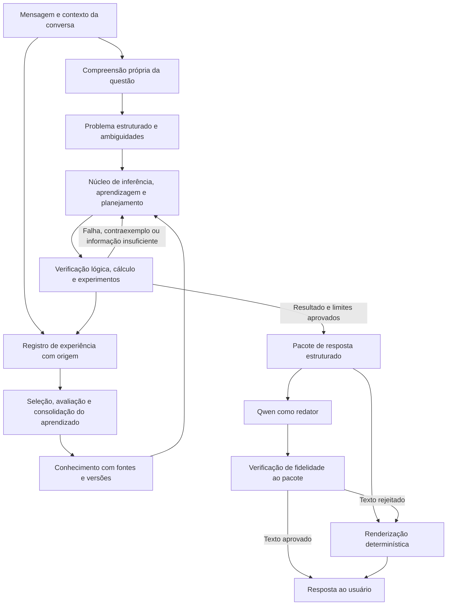

# TODO — Núcleo próprio de raciocínio artificial

Planejamento de pesquisa e desenvolvimento, atualizado em **08/09/2026**. Este documento define a direção pretendida; os itens pendentes não representam capacidades implementadas. Ele passa a ser o backlog principal de evolução do projeto e substitui a ordem de prioridades do roteiro anterior.

## 1. Objetivo e definição de sucesso

Construir uma IA que compreenda a questão e o contexto, aprenda com experiências, forme modelos do mundo, proponha explicações e soluções novas, teste suas propostas e revise o que aprendeu. **O processamento da questão, a escolha das premissas, as inferências e a seleção da conclusão devem acontecer no nosso núcleo antes da formulação textual pelo Qwen.**

O Qwen terá a função de redator de conteúdo já determinado. O núcleo deverá funcionar e ser avaliado com esse modelo completamente desligado, incluindo a etapa de compreensão da entrada. Bibliotecas matemáticas, bancos de dados e simuladores podem ser utilizados; sua participação e seus conhecimentos incorporados precisam ser declarados.

A referência a Einstein e Stephen Hawking multiplicados por 1.000 expressa a ambição de descoberta científica e invenção. Ainda não temos uma definição mensurável dessa comparação nem uma receita comprovada para alcançá-la. Vamos avaliar progresso por capacidade de aprender, generalizar, descobrir relações e produzir soluções novas que resistam a verificações independentes. Gerar mil ideias não equivale a gerar mil descobertas válidas.

Aprender com poucos dados depende do domínio, das hipóteses prévias e da informação disponível. Se dois modelos explicam igualmente os exemplos e discordam sobre a próxima situação, a resposta correta pode ser reconhecer a ambiguidade e escolher um novo experimento. A avaliação deverá contabilizar conhecimentos prévios e experiência, como propõe a discussão de [Chollet sobre avaliação da inteligência](https://arxiv.org/abs/1911.01547).

## 2. Ponto de partida no código

| Área | O que existe | O que falta para o objetivo |
| --- | --- | --- |
| Conversa | Interface, histórico por conversa, resposta progressiva e modelo local | Fazer o núcleo controlar o significado da resposta e o contexto da tarefa |
| Compreensão | Extração local limitada e extração adicional por modelo em `src/chat/engine.py` e `src/chat/extraction.py` | Compreensão própria, com perguntas, referências, objetivos, quantidades e ambiguidades |
| Memória | SQLite, afirmações, fontes, dependências e revisão em `src/chat/memory.py` | Conceitos, eventos, modelos, experimentos, incerteza quantitativa e regras aprendidas |
| Inferência | Regras explícitas e propostas de oposição, analogia e composição em `src/chat/reasoner.py` | Aprender regras novas, raciocinar causalmente, planejar e testar hipóteses |
| Linguagem | `src/chat/provider.py` permite conhecimento geral do modelo; `engine.py` chama o modelo para responder | Contrato que restrinja o Qwen à verbalização de resultados aprovados |
| Aprendizado | Registro de mensagens e atualização de conhecimento estruturado | Aprendizado de modelos, operadores e estratégias; treinamento de redes próprias |
| Física e quântica | O ciclo atual do chat não possui simulador físico ou módulo quântico integrado | Laboratórios quantitativos com referências, limites e experimentos reproduzíveis |
| Validação | Testes funcionais do chat e roteiro qualitativo com modelo real | Avaliação independente de generalização, contribuição do núcleo e validade de invenções |

Os documentos da fase de pássaros são históricos. Seus percentuais de conclusão e nomes de capacidades não servem como evidência de que o novo núcleo já possui essas capacidades. O estado atual está descrito em [CHATBOT_ARCHITECTURE.md](docs/CHATBOT_ARCHITECTURE.md) e [CHATBOT_VALIDATION.md](docs/CHATBOT_VALIDATION.md).

## 3. Arquitetura a construir

O pacote aprovado deve conter a resposta semântica, conclusões, premissas, fontes, hipóteses, incertezas, cálculos, resultados de testes e eventuais perguntas de esclarecimento. Uma explicação em prosa não substitui um registro verificável de operações e evidências.

**Limite de confiança:** um prompt dizendo “apenas reescreva” não garante fidelidade. O redator pode acrescentar fatos ou mudar uma negação. O modo de pesquisa usa saída determinística; a redação livre só será habilitada nos casos em que pudermos verificar o contrato. Textos do redator não entram automaticamente na memória como evidência.

## 4. Como executar o backlog

- **P0:** necessário para demonstrar independência do núcleo e medir resultados corretamente.
- **P1:** desenvolvimento das capacidades centrais de aprendizagem, raciocínio e invenção.
- **P2:** ampliação de domínio e maturidade operacional.
- **Pesquisa:** abordagem cujo benefício precisa ser testado; pode ser revista ou abandonada conforme os resultados.

As fases organizam dependências, não datas prometidas. Cada item concluído deve apontar para código ou documento, experimento reproduzível e resultado observado. Uma funcionalidade entregue não significa que sua hipótese científica foi confirmada. Cada critério de saída vale para o domínio e conjunto de avaliação declarados.

### F00 — Especificação científica e avaliação inicial · P0

Dependências: nenhuma. Entregáveis: especificação de capacidades, inventário de dependências e protocolo de avaliação.

- [ ] **F00-01** Definir operacionalmente compreensão, dedução, indução, analogia, criação, invenção e aprendizado; estabelecer uma tarefa observável e um critério de falha para cada capacidade.
- [ ] **F00-02** Auditar código e documentação, classificando cada capacidade como implementada, limitada, planejada ou sem evidência; registrar todas as chamadas a modelos externos e todos os conhecimentos embutidos nas regras.
- [ ] **F00-03** Separar quatro níveis de aprendizado: registrar experiência, atualizar crenças, aprender regras/modelos e melhorar estratégias de aprendizagem. Definir quais dados e métricas demonstram cada nível.
- [ ] **F00-04** Criar um gerador de pequenos mundos com objetos, ações e regras variáveis. Separar famílias de tarefas para desenvolvimento, validação e teste reservado, com nomes novos e sementes reproduzíveis.
- [ ] **F00-05** Registrar as referências de comparação: memória sem inferência, regras atuais, busca simbólica, modelos estatísticos simples, Qwen isolado e núcleo com/sem Qwen. Declarar diferenças de treinamento prévio e oferecer as mesmas evidências de teste.
- [ ] **F00-06** Definir antecipadamente métricas, orçamento de exemplos e computação, repetições e critérios de decisão. Dimensionar a avaliação para relatar incerteza e evitar escolher apenas exemplos favoráveis.
- [ ] **F00-07** Criar um registro de hipóteses de pesquisa: mecanismo proposto, previsão, alternativa mais simples, experimento que pode refutá-lo e decisão após o resultado.
- [ ] **F00-08** Escolher o primeiro domínio quantitativo delimitado e inventariar recursos locais. Usar inicialmente transformações de estados e mecânica simples; registrar dados, ferramentas, competências e custos que faltam.

**Saída:** alguém consegue executar a avaliação inicial, identificar o que veio do Qwen e entender o que exatamente o projeto tentará melhorar.

### F01 — Separação executável entre núcleo e redator · P0

Dependências: F00. Entregáveis: contratos de entrada/saída e primeiro fluxo completo com o redator desligado.

- [ ] **F01-01** Definir um `ProblemSpec` versionado com intenção, entidades, relações, fatos fornecidos, pergunta, metas, restrições, referências ao contexto e lacunas de informação.
- [ ] **F01-02** Definir um `AnswerPackage` versionado com conteúdo aprovado, identificadores de evidência, condições de validade, cálculos, hipóteses e limites. Prever resultados como respondido, ambíguo, desconhecido, contraditório e orçamento esgotado.
- [ ] **F01-03** Refatorar o fluxo de `engine.py` para concluir o processamento e a verificação antes de chamar o redator. Retirar do caminho independente a extração pelo Qwen e qualquer delegação de decisões a ele.
- [ ] **F01-04** Criar um modo de pesquisa que bloqueie chamadas ao Qwen e a outros modelos gerais em todas as etapas. Começar com entrada estruturada e um subconjunto declarado do português, mantendo o mesmo contrato do núcleo.
- [ ] **F01-05** Criar um renderizador determinístico e limitar o adaptador Qwen ao pacote e às instruções de estilo aprovadas. Informações do histórico necessárias à redação devem ser selecionadas pelo núcleo.
- [ ] **F01-06** Verificar entidades, números, unidades, fórmulas, negações, fontes e grau de certeza após a redação. Onde não houver verificação semântica confiável, usar a saída determinística; a aprovação pelo próprio Qwen não basta.
- [ ] **F01-07** Impedir a exibição de afirmações ainda não aprovadas durante o streaming. Separar progresso do processamento de conteúdo final; testar falha, indisponibilidade e alteração indevida pelo redator.

**Saída:** uma tarefa do domínio inicial produz o mesmo conteúdo semântico com Qwen ligado, desligado ou substituído. O registro mostra que o pacote já estava concluído antes da chamada de redação.

### F02 — Compreensão própria da pergunta e do contexto · P0 → P1

Dependências: F01. Entregáveis: processador de linguagem próprio e conjunto anotado de conversas.

- [ ] **F02-01** Construir um analisador que diferencie pergunta, afirmação, correção, hipótese, pedido de criação e restrição de formato; preservar negações, quantificadores e condições.
- [ ] **F02-02** Representar o estado da conversa: assunto, objetivo ativo, entidades, referências como “isso” e “a última resposta”, mudanças de assunto e informações ainda pendentes.
- [ ] **F02-03** Extrair números, unidades, intervalos, variáveis, equações, eventos e relações temporais; detectar incompatibilidades de tipo e unidade já na entrada.
- [ ] **F02-04** Tratar ambiguidades explicitamente: manter interpretações candidatas ou formular uma pergunta específica. Não preencher silenciosamente lacunas com conhecimento do redator.
- [ ] **F02-05** Criar dados de treino e avaliação com paráfrases, erros de digitação, elipses e conversas com múltiplos assuntos; manter a interpretação estruturada esperada como referência.
- [ ] **F02-06** Evoluir da gramática inicial para modelos neurais próprios de compreensão, com arquitetura, dados, pesos e treinamento documentados. Medir cobertura antes de ampliar o português aberto; dados sintéticos de outro modelo exigem procedência e avaliação separada.
- [ ] **F02-07** Testar alterações mínimas que mudam a resposta: entidade, valor, negação, tempo e objetivo. Incluir perguntas com palavras parecidas e significados diferentes, além de assuntos sem relação com os exemplos originais.

**Saída:** no escopo declarado, a última mensagem e o contexto correto determinam o problema estruturado. Entradas fora desse escopo geram esclarecimento ou limitação explícita, com taxa de erro medida.

### F03 — Representação do conhecimento e memória revisável · P0 → P1

Dependências: F01; pode avançar junto de F02. Entregáveis: modelo de conhecimento e migração da memória.

- [ ] **F03-01** Ampliar triplas para estruturas tipadas: entidades, atributos, relações com múltiplos argumentos, eventos, estados, regras condicionais, equações, ações e objetivos.
- [ ] **F03-02** Distinguir memória de episódios, conhecimento conceitual, procedimentos aprendidos, modelos do mundo e experimentos; conectar cada item à experiência que o originou.
- [ ] **F03-03** Registrar fonte, data, escopo, versão, hipótese de domínio e forma de obtenção. Separar afirmação do usuário, resultado observado, dedução condicional e hipótese do motor.
- [ ] **F03-04** Representar desconhecimento, conflito e incerteza. Separar confiança na extração, credibilidade da fonte, probabilidade de um evento e validade de uma derivação; evitar um número único sem interpretação.
- [ ] **F03-05** Ampliar revisão de crenças e invalidação de dependências para regras, modelos e planos. Mudanças de contexto ou tempo não devem ser tratadas automaticamente como contradições.
- [ ] **F03-06** Recuperar conhecimento por significado, estrutura e objetivo, preservando a origem. Se houver embeddings, declarar seu treinamento e testar se a busca encontra a premissa necessária sem confundir similaridade com evidência.
- [ ] **F03-07** Definir escopos de conhecimento da conversa, do usuário e do laboratório. Criar migração com backup, exportação e retirada de dados, preservando as conversas existentes.

**Saída:** toda conclusão pode ser ligada às premissas utilizadas; corrigir uma premissa retira ou reavalia suas consequências, inclusive planos e modelos afetados.

### F04 — Mecanismos próprios de raciocínio · P1

Dependências: F02 no domínio inicial e F03. Entregáveis: operadores de inferência, busca e verificação.

- [ ] **F04-01** Implementar dedução com variáveis, tipos, condições e composição de regras. Gerar uma derivação que um verificador separado possa conferir.
- [ ] **F04-02** Implementar indução de regras candidatas a partir de exemplos e contraexemplos; comparar alternativas por previsão, complexidade e compatibilidade com os dados.
- [ ] **F04-03** Implementar abdução: propor explicações para uma observação, listar alternativas e indicar quais evidências as distinguem.
- [ ] **F04-04** Implementar analogia por correspondência entre estruturas e papéis, com pré-condições para transferir relações. Medir também transferências incorretas entre domínios.
- [ ] **F04-05** Representar modelos causais, intervenções e perguntas contrafactuais; declarar hipóteses necessárias e reconhecer efeitos que não podem ser identificados com os dados disponíveis.
- [ ] **F04-06** Criar planejamento por estados, ações, pré-condições, efeitos e restrições. Buscar sequências verificáveis para atingir uma meta, incluindo caminhos que falham.
- [ ] **F04-07** Controlar a busca por custo, tempo, memória e utilidade esperada; detectar ciclos, conclusões repetidas e contradições. Encerrar com resultado parcial explícito quando necessário.
- [ ] **F04-08** Distinguir conclusão demonstrada, previsão dependente de modelo e hipótese exploratória. Tratar oposição como um gerador possível de hipóteses: a existência de uma propriedade não prova a existência de seu contrário.

**Saída:** o núcleo resolve tarefas novas de composição e explica suas dependências, reconhece casos indeterminados e rejeita inferências inválidas. O tratamento causal se apoia em pressupostos explícitos, conforme o formalismo de [Pearl](https://ftp.cs.ucla.edu/pub/stat_ser/r350.pdf).

### F05 — Redes neurais próprias e aprendizado com poucos exemplos · P1 / Pesquisa

Dependências: F00, F03 e F04. Entregáveis: primeiro modelo treinado pelo projeto e relatório de generalização.

- [ ] **F05-01** Selecionar uma primeira função neural delimitada, como prever transições ou ordenar hipóteses. Definir entradas, alvos, função de perda e comparação com soluções sem rede neural.
- [ ] **F05-02** Treinar um modelo pequeno com pesos inicializados pelo projeto. Registrar arquitetura, dados, sementes, versões, curvas de aprendizagem e uso de recursos; distinguir regras programadas de relações aprendidas.
- [ ] **F05-03** Aprender operadores reutilizáveis a partir de transições observadas, com condições de aplicação. Avaliar combinações que não foram mostradas nos exemplos.
- [ ] **F05-04** Medir adaptação com diferentes quantidades de exemplos e com ruído. Contabilizar todo treinamento anterior, inclusive metatreinamento; “um exemplo novo” não significa ausência de experiência prévia.
- [ ] **F05-05** Integrar propostas neurais ao verificador lógico ou físico. A rede poderá sugerir candidatos; validade e grau de apoio precisam de critérios independentes da sua pontuação.
- [ ] **F05-06** Pesquisar aprendizagem de representações, abstrações e estratégias reutilizáveis entre famílias de tarefas. Avaliar generalização para regras e estruturas novas, além de renomear objetos conhecidos.
- [ ] **F05-07** Implementar escolha ativa de exemplos ou experimentos para reduzir incerteza. Comparar o ganho obtido por consulta com seleção aleatória e heurísticas simples.
- [ ] **F05-08** Fazer experimentos retirando memória, rede, busca e verificador, um componente por vez. Manter cada componente quando houver benefício demonstrado ou uma função operacional claramente necessária.

**Saída:** o núcleo melhora em tarefas reservadas após aprender, com Qwen ausente; o relatório distingue memorização, composição de regras fornecidas e aprendizagem de uma regra que não estava programada. Modelos causais, composicionalidade e aprender a aprender são direções de pesquisa discutidas por [Lake e colaboradores](https://arxiv.org/abs/1604.00289), sem constituírem garantia de inteligência geral.

### F06 — Física como modelo do mundo e verificação de hipóteses · P1 / Pesquisa

Dependências: F03 e F04; comparação neural depende de F05. Entregáveis: laboratório físico limitado, modelos e testes de referência.

- [ ] **F06-01** Construir ambientes iniciais de movimento, forças, colisões ou circuitos simples, escolhendo um por vez. Definir variáveis, unidades, condições iniciais, ações disponíveis e resultados observáveis.
- [ ] **F06-02** Implementar análise dimensional e restrições físicas com domínio de validade. Leis de conservação devem considerar fronteiras, forças externas, dissipação e hipóteses do modelo.
- [ ] **F06-03** Validar simuladores contra soluções analíticas ou implementações independentes; medir erro numérico, estabilidade e sensibilidade. Não validar uma previsão apenas com a mesma rotina que a gerou.
- [ ] **F06-04** Aprender parâmetros e modelos de dinâmica a partir de observações, incluindo ruído e variáveis parcialmente observadas. Avaliar previsões em condições não usadas no ajuste.
- [ ] **F06-05** Criar busca de equações por regressão simbólica, usando unidades, simetrias e simplicidade como restrições declaradas. Manter leis fornecidas para verificação separadas das leis que o experimento pretende descobrir.
- [ ] **F06-06** Comparar redes com restrições físicas, modelos sem essas restrições e métodos numéricos tradicionais. Medir precisão, dados necessários, custo e falhas fora do domínio.
- [ ] **F06-07** Permitir ao núcleo formular um experimento físico simulado, prever resultados, executar o teste e revisar o modelo. Armazenar também previsões refutadas e suas causas.
- [ ] **F06-08** Transferir modelos para dados medidos e problemas maiores somente após avaliar diferença entre simulação e realidade. Registrar quando uma hipótese sugere falha do modelo vigente, em vez de declarar uma nova lei automaticamente.

**Saída:** um modelo aprendido prevê novos resultados e uma hipótese inadequada é rejeitada por teste independente. Usar física significa representar mecanismos e restrições verificáveis. [AI Feynman](https://arxiv.org/abs/1905.11481) oferece uma referência de descoberta de expressões em tarefas delimitadas; [Physics-informed machine learning](https://www.nature.com/articles/s42254-021-00314-5) fundamenta a comparação entre aprendizado e conhecimento físico incorporado.

### F07 — Inovação e invenção orientadas a objetivos · P1 / Pesquisa

Dependências: F04, F05 e primeiro laboratório de F06. Entregáveis: gerador de soluções testáveis e protocolo de seleção.

- [ ] **F07-01** Representar pedidos de invenção como metas mensuráveis, recursos, restrições, orçamento e critérios de sucesso. Exigir clareza sobre o problema que a proposta pretende resolver.
- [ ] **F07-02** Gerar candidatos por composição, abstração, analogia estrutural, mudança de premissas e busca de programas ou projetos. Registrar qual transformação originou cada candidato.
- [ ] **F07-03** Produzir artefatos verificáveis: plano de ações, expressão matemática, programa ou especificação de um mecanismo. A descrição textual deverá derivar desse artefato.
- [ ] **F07-04** Avaliar utilidade, viabilidade, novidade, robustez e custo separadamente. Comparar com soluções conhecidas e medir ganhos após considerar os recursos consumidos.
- [ ] **F07-05** Criar o ciclo propor → prever → testar → analisar falha → revisar. Dedicar parte do orçamento à busca de contraexemplos e casos extremos.
- [ ] **F07-06** Medir diversidade real de mecanismos e eliminar paráfrases da mesma ideia. Escolher experimentos que diferenciem candidatos, evitando maximizar apenas o número de propostas.
- [ ] **F07-07** Incorporar resultados negativos e condições de falha à memória de procedimentos. Testar transferência para novos problemas sem repetir um erro já identificado.

**Saída:** o sistema entrega uma solução que cumpre uma meta inédita no ambiente reservado, com avaliação independente e comparação explícita. Ser nova para o sistema ainda não prova que seja nova para a ciência.

### F08 — Mecânica quântica e modelos de cognição quântica · Pesquisa

Dependências: F00 e contratos de F01; integração com raciocínio e física depende de F04/F06. Entregáveis: experimentos separados, com relatório favorável ou desfavorável.

A frente quântica integra o programa de pesquisa, com três perguntas distintas:

| Linha | O que testar | O que um resultado positivo permite afirmar |
| --- | --- | --- |
| Mecânica quântica como domínio físico | Aprender e prever sistemas quânticos pequenos | Competência no domínio estudado |
| Formalismo quântico aplicado à cognição | Representar contexto e ordem da informação e comparar modelos | Melhor ajuste ou previsão em tarefas específicas |
| Computação quântica como recurso | Executar um algoritmo adequado e comparar custo total | Vantagem na tarefa e condições medidas |

Modelos de cognição quântica utilizam um formalismo matemático que, em geral, não pressupõe um cérebro fisicamente quântico. Essa distinção está explícita no tutorial de [Yearsley e Busemeyer](https://jbusemey.pages.iu.edu/quantum/YearselyBusemeyerJMP.pdf). Aplicar esse formalismo ao nosso núcleo é uma hipótese de pesquisa; não demonstra, por si só, raciocínio humano ou criatividade superior.

- [ ] **F08-01** Especificar o papel de cada conceito quântico proposto em equações e operações executáveis. Evitar usar “superposição”, “emaranhamento” ou “colapso” apenas como nomes para listas, associações ou escolha de resposta.
- [ ] **F08-02** Criar um laboratório clássico de simulação de sistemas quânticos pequenos: estados, observáveis, evolução e medição. Começar por casos com solução conhecida, como um sistema de dois níveis.
- [ ] **F08-03** Validar normalização, probabilidades de Born e evolução unitária quando aplicável; testar resultados analíticos e contabilizar erro numérico. Modelos abertos ou com ruído exigem hipóteses e verificações próprias.
- [ ] **F08-04** Avaliar se o núcleo aprende parâmetros, distingue modelos candidatos e escolhe medições informativas nesse laboratório. Separar previsões aprendidas de resultados fornecidos pelo simulador.
- [ ] **F08-05** Implementar um experimento de cognição quântica sobre efeitos de contexto ou ordem, usando dados adequados. Comparar com modelos clássicos que também representem contexto, com complexidade e orçamento comparáveis.
- [ ] **F08-06** Testar separadamente se o mecanismo melhora resolução lógica ou invenção. Reproduzir um efeito de decisão humana não implica raciocinar melhor; medir erros e sensibilidade à ordem quando ela deveria ser irrelevante.
- [ ] **F08-07** Medir custo de simulação antes de aumentar o espaço de estados. A representação densa de um vetor de estado de n qubits contém 2ⁿ amplitudes; investigar aproximações apenas onde sejam válidas e documentar o erro introduzido.
- [ ] **F08-08** Avaliar hardware quântico somente se houver algoritmo e caso de uso que justifiquem o experimento, incluindo preparação, leitura, ruído e custo. Registrar a decisão de integrar, reformular ou encerrar cada hipótese, mesmo quando não houver vantagem.

**Saída:** cada linha tem resultados reproduzíveis e uma conclusão proporcional à evidência. Simulação em computador clássico é suficiente para iniciar; a necessidade de hardware quântico permanece uma decisão experimental. O custo da representação densa está documentado no [Qiskit Aer](https://qiskit.github.io/qiskit-aer/stubs/qiskit_aer.StatevectorSimulator.html).

### F09 — Aprendizado contínuo com estabilidade · P1

Dependências: F03 e F05. Entregáveis: ciclo de consolidação, avaliação e reversão de aprendizado.

- [ ] **F09-01** Transformar cada interação em experiência classificada: pergunta, informação, correção, preferência, resultado de teste ou exemplo de tarefa. Nem toda mensagem contém conhecimento factual novo.
- [ ] **F09-02** Separar atualização imediata de contexto e memória da consolidação de regras e treinamento de pesos. Definir os eventos que acionam cada processo e como seu efeito será medido.
- [ ] **F09-03** Selecionar dados de treinamento pela origem, qualidade e relevância; impedir que respostas geradas ou repetição de uma alegação sejam usadas como confirmação independente.
- [ ] **F09-04** Avaliar mecanismos para conservar capacidades anteriores, incluindo repetição de experiências selecionadas e modularização. Medir esquecimento, interferência e adaptação a mudanças reais do domínio.
- [ ] **F09-05** Versionar conjuntos de dados, memória, regras e pesos; avaliar uma versão candidata antes de adotá-la e oferecer reversão reproduzível.
- [ ] **F09-06** Testar ensinamentos incorretos, fontes conflitantes e correções posteriores. Mensagens e documentos ingeridos não devem alterar permissões, verificadores ou critérios de avaliação.
- [ ] **F09-07** Planejar exclusão de dados e remoção de sua influência. Distinguir apagar mensagens, invalidar conhecimento e retirar informação incorporada aos pesos; avaliar retreinamento quando necessário.

**Saída:** experiências novas trazem ganho medido sem perda inaceitável nas capacidades anteriores; é possível identificar o que mudou, por quê e como retornar à versão anterior.

### F10 — Da solução de laboratório à descoberta científica · P2 / Pesquisa

Dependências: F06, F07 e aprendizado controlado de F09; F08 quando o domínio exigir. Entregáveis: dossiês de descoberta e replicação independente.

- [ ] **F10-01** Escolher um problema científico ou de engenharia delimitado com dados confiáveis, referência de comparação e verificação acessível. Definir quais resultados teriam utilidade real.
- [ ] **F10-02** Criar aquisição de conhecimento de artigos, conjuntos de dados e experimentos, com procedência, licenças, unidades, condições e incertezas; validar a interpretação antes de incorporá-la ao núcleo.
- [ ] **F10-03** Implantar busca de trabalhos e soluções anteriores. Classificar novidade para o sistema, novidade no conjunto estudado e possível novidade científica; registrar o alcance da busca, sem tratá-la como prova de inexistência anterior.
- [ ] **F10-04** Começar por redescobertas controladas, ocultando do aprendiz a relação que deve encontrar. Impedir acesso à resposta por nomes, metadados, regras do verificador ou documentos usados no treino.
- [ ] **F10-05** Passar a problemas abertos apenas após demonstrar competência nas referências anteriores. Produzir previsões discriminantes e condições de refutação para cada proposta.
- [ ] **F10-06** Preparar um dossiê com dados, hipóteses, método, artefato, resultados, comparações, limitações e passos de reprodução. Avaliar novidade e utilidade com especialistas sem revelar a origem das propostas quando viável.
- [ ] **F10-07** Replicar resultados com dados, simuladores ou medições independentes; registrar resultados negativos. Uma melhoria simulada só pode ser anunciada como melhoria real após validação adequada ao domínio.

**Saída:** uma contribuição tem utilidade demonstrada, avaliação de trabalhos anteriores e reprodução independente. Aumentar o número de domínios ou a autonomia depende da repetição desse resultado, não da fluência do chat.

### F11 — Engenharia, recursos e uso do laboratório · P0 transversal → P2

Dependências: começa em F00; acompanha todas as fases. Entregáveis: infraestrutura reproduzível, dados migráveis e interface que apresenta evidências.

- [ ] **F11-01** Isolar dados de experimento das conversas pessoais; criar migrações versionadas, backups verificáveis e restauração testada antes das alterações de esquema.
- [ ] **F11-02** Retirar cálculo, simulação e chamadas demoradas de transações longas do banco; implementar cancelamento, limites de execução, filas quando necessárias e recuperação após falha.
- [ ] **F11-03** Executar programas e experimentos gerados em ambiente isolado, com acesso e recursos limitados. Novos operadores passam por avaliação antes de poderem atuar no sistema principal.
- [ ] **F11-04** Registrar tempos de compreensão, busca, teste e redação, consumo de memória e custo por solução válida. Começar com experiências pequenas no hardware local e dimensionar recursos a partir de medições.
- [ ] **F11-05** Criar uma interface de evidências com fontes, condições, incertezas, revisões e experimentos. O chat deve continuar respondendo à mensagem atual; detalhes técnicos ficam acessíveis quando ajudam a avaliar a resposta.
- [ ] **F11-06** Separar testes de software, avaliações de modelos e experimentos científicos. Automatizar a reprodução com configuração, sementes, versões e relatórios, incluindo falhas e resultados negativos.
- [ ] **F11-07** Planejar privacidade e escopo de compartilhamento antes de múltiplos usuários ou serviços externos; definir exportação, exclusão e quais conversas podem participar de treinamento.
- [ ] **F11-08** Atribuir responsável por frente e registrar competências necessárias: engenharia, aprendizado de máquina, lógica, estatística e física; buscar revisão especializada para afirmações quânticas e científicas. Estimar esforço após o primeiro experimento de cada frente.

**Saída:** os resultados são reproduzíveis, a aplicação pode ser recuperada após falhas e o custo para obter cada melhoria é conhecido.

## 5. Avaliação obrigatória desde o início

Os limites numéricos de aprovação serão definidos no protocolo F00-06 antes de observar o teste reservado. Critérios formais exatos podem ser exigidos em conjuntos delimitados; resultados estatísticos precisam informar amostra, variabilidade e intervalo de confiança apropriado.

| Pergunta | Como medir | Proteção contra uma conclusão enganosa |
| --- | --- | --- |
| O núcleo compreendeu a mensagem? | Correspondência entre `ProblemSpec` e anotação, por tipo de entrada | Alterar contexto, entidade, negação e objetivo; separar cobertura de acerto |
| A conclusão veio do nosso núcleo? | Pacote e derivação obtidos sem Qwen em nenhuma etapa | Verificar chamadas e repetir com redator desligado ou trocado |
| Aprendeu com poucos exemplos? | Curvas de desempenho por quantidade de experiências | Contar treinamento prévio e separar famílias de tarefas |
| Generalizou? | Sucesso com novas regras, estruturas e combinações | Renomear exemplos conhecidos é apenas um dos controles |
| Sabe quando não sabe? | Calibração, respostas indevidas e abstenções corretas | Incluir casos ambíguos, inconsistentes e sem solução |
| O aprendizado persiste e pode ser corrigido? | Retenção, adaptação e revisão de dependências | Testar reinício, contradição, retirada e reversão de versão |
| A física acrescenta valor? | Erro preditivo, violações, dados e custo | Comparar com modelo sem restrições e solver de referência |
| A abordagem quântica acrescenta valor? | Ganho fora da amostra por tarefa e custo | Comparar com modelo clássico que também represente contexto |
| Criou algo útil? | Cumprimento da meta, robustez e ganho sobre soluções anteriores | Avaliar o artefato e a execução, além do texto |
| É uma descoberta científica? | Busca documentada de trabalhos anteriores e replicação | Distinguir redescoberta, novidade local e possível novidade científica |
| O redator preservou o conteúdo? | Afirmações adicionais, omissões e mudanças de certeza | Conferir contra o pacote; usar saída determinística quando necessário |

O teste reservado não deve alimentar treinamento ou escolha de parâmetros. Se for usado repetidamente para orientar desenvolvimento, passa a ser validação e precisa ser substituído por um novo teste reservado. Comparações com Qwen devem declarar que seu treinamento prévio não é controlado pelo projeto.

## 6. Pontos que também precisamos resolver

| Ponto fácil de deixar de fora | Consequência para o projeto | Onde será tratado |
| --- | --- | --- |
| Compreender português já exige aprendizagem e conhecimento | Tirar o Qwen da redação não cria um interpretador próprio | F01, F02 |
| Guardar conversas não ensina automaticamente a raciocinar | É preciso medir mudança de regras, modelos e estratégias | F00, F05, F09 |
| Poucos exemplos podem permitir várias explicações | O motor precisa lidar com incerteza e buscar novos dados | F04, F05 |
| Uma premissa falsa pode sustentar uma dedução formalmente válida | Separar validade lógica de verdade sobre o mundo | F03, F04, F06 |
| Inventar exige uma meta e contato com resultados | Precisamos de problemas, simuladores e feedback verificável | F06, F07 |
| As leis inseridas pelo programador podem fornecer a resposta | Declarar conhecimentos prévios e impedir vazamento na avaliação | F00, F06, F10 |
| Reproduzir vieses humanos não garante raciocínio melhor | Separar semelhança cognitiva de precisão e utilidade | F08 |
| Um simulador pode confirmar o próprio erro | Usar referência independente e depois medições reais | F06, F10 |
| Novidade depende do que já existe fora do projeto | Buscar trabalhos anteriores e obter revisão especializada | F10 |
| Busca e simulação podem crescer além dos recursos disponíveis | Definir orçamento, aproximações válidas e critério de parada | F04, F08, F11 |
| Aprender continuamente também permite aprender erros | Consolidar com avaliação, procedência e reversão | F03, F09 |
| Um redator fluente pode esconder falhas do núcleo | Avaliar primeiro o conteúdo estruturado com Qwen ausente | F01 e avaliação transversal |
| Resolver um domínio não demonstra inteligência geral | Ampliar tarefas e domínios gradualmente, relatando limites | F00, F05, F10 |

## 7. Ordem recomendada para começar

1. **Especificar e medir:** executar F00 e estabelecer o registro de experimentos de F11.
2. **Demonstrar a separação:** executar F01 com o analisador local limitado e as regras existentes. Isso comprova o contrato, ainda sem anunciar novas capacidades de aprendizado.
3. **Ampliar compreensão e representação:** executar F02 e F03 no primeiro domínio e adicionar os mecanismos iniciais de F04.
4. **Demonstrar aprendizado próprio:** executar F05; manter a mesma tarefa, orçamento e avaliação ao comparar componentes.
5. **Fechar o ciclo de experimento:** executar F06 e F07, com consolidação controlada de F09.
6. **Avaliar a frente quântica:** desenvolver os experimentos de F08 sobre uma base de comparação já mensurada; a preparação teórica pode começar antes.
7. **Buscar contribuição científica:** avançar em F10, expandindo domínio, recursos e autonomia conforme os resultados.

### Primeiro marco concreto

O primeiro marco de independência é F01: o mesmo pacote de resposta com o redator ligado ou desligado. O primeiro marco de **aprendizado próprio** vem depois, com este experimento:

- Gerar um mundo com estados e ações de nomes novos, inacessível ao Qwen.
- Fornecer poucas observações de transições, declarando o que se sabe sobre determinismo e condições de aplicação.
- Pedir que o núcleo encontre uma sequência para alcançar um estado ainda não obtido nas demonstrações.
- Exigir a regra ou modelo aprendido, o plano e uma execução verificada em condições reservadas.
- Incluir uma tarefa ambígua em que seja necessário pedir outra observação e uma correção que invalide um plano anterior.
- Repetir com outras famílias de regras e comparar memória, busca programada e componente aprendido.

Os casos e seus resultados são gerados no experimento; não devem virar respostas fixas no código. Esse marco demonstra uma capacidade delimitada de aprender e compor. Os marcos seguintes precisam mostrar que ela se transfere para física, invenções verificáveis e novos domínios.

## 8. Critério de conclusão de cada item

Marcar um item somente quando houver seu entregável e evidência proporcional à alegação: teste funcional para comportamento de software; experimento e comparação para ganho de capacidade; avaliação independente para validade científica. Registrar também hipóteses refutadas e abordagens descartadas. A decisão de encerrar uma linha sem ganho demonstrado é um resultado de pesquisa válido, sem ser contabilizada como capacidade conquistada.
