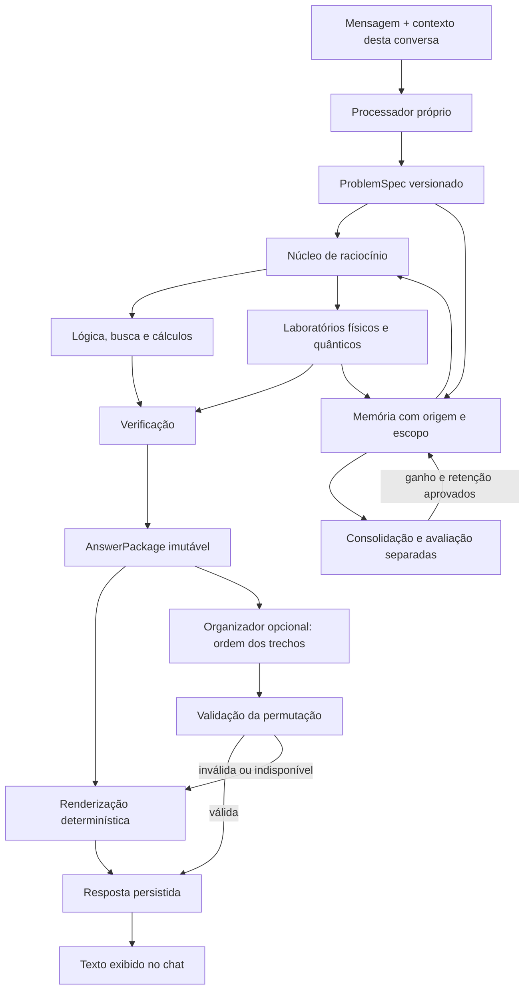

# Arquitetura do núcleo conversacional

Estado da implementação em setembro de 2026. O [TODO](../TODO.md) distingue requisitos aprovados, parciais e pendentes. A presente arquitetura substitui o fluxo em que Qwen extraía fatos e respondia com conhecimento próprio.

## Fronteira principal

A resposta do organizador não alimenta a memória como evidência. No modo de pesquisa, a aresta até Qwen não é executada; o adaptador de rede também bloqueia suas chamadas. Iniciar a aplicação nesse modo não inicia nem baixa modelos gerais.

## Contratos e responsabilidades

| Módulo | Responsabilidade |
| --- | --- |
| `src/cognition/processor.py` | Interpretar português controlado ou uma tarefa JSON; resolver referências, preservar informações fornecidas e indicar ambiguidade |
| `src/chat/discourse.py` | Separar alvo, referência e suposição local; decompor funções, conjunções, negações e qualificações causais |
| `src/chat/reasoner.py` | Gerar hipóteses por oposição/analogia e compor conversões; repetir a transformação no verificador antes da persistência |
| `src/chat/memory.py` | Conservar premissas e fontes; revisar relações e invalidar hipóteses que perderam apoio |
| `src/cognition/contracts.py` | Validar e congelar `ProblemSpec`/`AnswerPackage`; produzir hash e validar organização dos trechos |
| `src/cognition/engine.py` | Escolher operação, executar mecanismos próprios e construir o conteúdo aprovado |
| `src/cognition/reasoning.py` | Inferências com variáveis, verificação, busca de planos, hipóteses, intervenções e aritmética |
| `src/cognition/store.py` | Guardar estruturas tipadas, fontes, escopos, incertezas, dependências e modelos versionados |
| `src/cognition/learning.py` | Selecionar dados, medir ganho/ retenção e controlar adoção/reversão de versões |
| `src/cognition/neural.py` | Treinar e consultar o classificador próprio de intenção; registrar a proposta sem lhe atribuir autoridade semântica |
| `src/cognition/operators.py` | Ajustar transições, manter candidatos, selecionar consultas e compor programas verificáveis em uma família explícita |
| `src/cognition/operator_runtime.py` | Integrar modelos e procedimentos ao chat, preservar contraprovas e recuperar operações concluídas sem repetir seus efeitos |
| `src/science/` | Executar operações quantitativas em domínios explícitos e produzir resultados de teste |
| `src/chat/engine.py` | Integrar histórico, núcleo, experiência e redação; persistir envios recuperáveis |
| `src/chat/server.py` | API local, fila limitada, progresso, cancelamento, configuração e exportação |
| `src/chat/web/` | Conversa e inspeção de evidências, sem interpretar HTML de mensagens |

`ProblemSpec` contém versão, mensagem, intenção, entidades, relações, fatos, pergunta, metas, restrições, contexto, ambiguidades e carga estruturada. `AnswerPackage` contém identidade do problema, status, trechos aprovados, conclusões, premissas, fontes, hipóteses, cálculos, verificações, incerteza, limitações, esclarecimentos, domínio e operações. Estados de saída: `answered`, `ambiguous`, `unknown`, `contradictory`, `budget_exhausted`.

Os contratos armazenam JSON canônico imutável; acessar suas propriedades devolve dados destacados. O hash identifica o conteúdo efetivamente aprovado. Validar o esquema não prova, por si só, a verdade de uma conclusão: cada operador registra a verificação correspondente e os pressupostos que delimitam seu resultado.

## Interpretação e inferência

O processador inicial é uma gramática finita de português e um protocolo JSON. Identifica afirmações, perguntas, correções, hipóteses, preferências e pedidos específicos. Mantém referentes e última resposta aprovada da conversa, além de quantidades, unidades, intervalos e expressões. Ambiguidade tem saída explícita. Cobertura fora do corpus e de estruturas declaradas não é prometida; os modelos próprios de compreensão são avaliados separadamente.

A memória de triplas anterior continua útil para enunciados como “Todo cristal emite luz” e “Neral é cristal”. A dedução resultante passa por um verificador próprio antes de entrar no texto, inclusive quando as premissas foram inseridas em ordem diferente. Afirmações humanas são premissas condicionais, e não evidência científica externa.

Operadores estruturados permitem declarar relações, regras, estados, ações, observações, modelos causais, metas e orçamento. A dedução resolve variáveis e emite uma derivação verificável. Planejamento procura ações aplicáveis, confere a sequência e reconhece metas inalcançáveis no orçamento. Indução e abdução trabalham com classes candidatas explícitas; analogia requer correspondência de papéis. Contrafactuais dependem do modelo estrutural fornecido e não são identificados apenas por correlação.

Oposição linguística continua disponível como gerador limitado de hipóteses, com vocabulário declarado. Não prova a existência do oposto de uma entidade. Um pedido sobre “buraco de minhoca” não recupera “buraco negro” apenas por compartilhar uma palavra. Sem evidência pertinente, o núcleo responde com a lacuna específica.

### Correção do fluxo de conversa natural

Uma definição como “Neral é um dispositivo que armazena energia” produz uma relação de tipo e uma função, com a citação original. Conjunções preservam objetos e negações. Expressões causais são registradas como qualificações fornecidas; o mecanismo de oposição não transporta nem inverte causas. Definições antigas armazenadas numa única afirmação são lidas como projeções estruturadas com o mesmo ID e procedência, sem reescrever o histórico ou contar as projeções como evidências independentes.

O enquadramento da pergunta separa **alvo** e **referência**. “Considerando que Vetra é o inverso de Neral, o que Vetra faria?” aplica uma suposição restrita à pergunta. Perguntar se a relação existe não a ensina. Negar a suposição bloqueia sua aplicação, inclusive se a memória global contém a relação positiva. Uma pergunta sobre outra entidade não herda automaticamente essa suposição.

A oposição usa pares linguísticos declarados em `VERBAL_PAIRS` ou relações fornecidas. Uma relação fornecida substitui o mapeamento anterior aplicável; hipóteses antigas são reavaliadas e retiradas quando perdem apoio. Não há regra que invente nomes científicos por troca de cores. Para uma contraparte sem nome informado, o sistema usa uma descrição genérica. A analogia transfere uma propriedade como hipótese quando encontra características compartilhadas. A composição procura uma sequência de conversões que alcance a meta, com limite de seis etapas e orçamento finito.

O verificador refaz a transformação e exige objetos, polaridade, escopo, componentes e premissas compatíveis. A verificação antecede a persistência e é repetida antes da apresentação. Relações negativas simétricas e fontes retiradas invalidam dependentes. Uma hipótese recuperada continua marcada como hipótese: repetir a resposta não fornece confirmação independente. O pacote inclui a operação, suas fontes, o escopo temporário quando aplicável e uma proposta de teste. No caso de composição, confere-se a cadeia simbólica; perdas, interfaces e mecanismos físicos continuam sem validação se não foram modelados.

Esses mecanismos ampliam o português controlado, mas continuam sendo operadores fornecidos pelo programa. O classificador neural próprio não recebeu autoridade para inventar premissas, e não há treinamento automático de pesos a cada mensagem. A correção conversacional tem avaliação de regressão própria; não amplia retroativamente os resultados científicos dos pilotos anteriores.

## Ciclo de um envio e recuperação

1. Validar conteúdo/identificador, verificar cache e obter o contexto da conversa.
2. Construir `ProblemSpec` antes de qualquer chamada ao organizador.
3. Persistir mensagem e atualização imediata de premissas em transação curta.
4. Registrar experiência, revisar dependências e selecionar conhecimento.
5. Resolver e verificar o problema fora da transação do histórico.
6. Construir pacote imutável; renderizar diretamente ou consultar o organizador opcional.
7. Conferir a organização, persistir resposta/metadados e só então exibir o texto aprovado.

Um turno interrompido conserva o problema e o identificador para retomada. A retomada não reaplica aprendizado/correção já persistidos. Envios concorrentes do mesmo identificador e conteúdo retornam a mesma resposta do cache, sem duplicar mensagens. Reutilizar o identificador para outro conteúdo é recusado.

Operações que alteram modelos e procedimentos gravam seus efeitos e o resultado recuperável na mesma transação curta da memória tipada. O cálculo e a busca ocorrem antes dessa transação. O pacote aprovado também é conservado no histórico antes da redação; a recuperação confere se suas fontes continuam ativas, inclusive premissas do histórico antigo. Uma fonte retirada durante a interrupção impede reapresentar o resultado pendente como válido.

A fila local admite até oito participantes; o núcleo serializa turnos. Operações demoradas não seguram a transação do histórico. O cancelamento é cooperativo entre etapas, com limite mais forte no executor de programas. Uma chamada síncrona ao provedor pode esperar seu timeout antes de observar cancelamento. Desconectar a página não equivale a cancelar; é possível recuperar o envio pelo identificador.

## Redação fiel e streaming

Qwen recebe trechos completos com IDs e devolve apenas sua ordem. A resposta precisa conter cada ID exatamente uma vez, sem campos extras. Alterar conteúdo, inventar identificador, omitir trecho, repetir trecho ou falhar no provedor faz o sistema usar a ordem determinística. A prosa do modelo não é exibida.

Essa decisão limita a melhoria estilística oferecida pelo Qwen. O benefício arquitetural testado é independência do núcleo e preservação literal dos fatos, números, unidades e negações dos trechos. Não alegamos ter um verificador geral de paráfrases nem de redação livre.

`/api/chat/stream` separa eventos `progress`, `delta`, `done` e `error`. `delta` só contém a resposta já verificada e persistida. A interface apresenta o estado do processamento e permite expandir evidências e métricas sem impor JSON à leitura da resposta comum.

## Aprendizado, física e operação

O chat registra experiências imediatamente; o controlador de aprendizado aplica uma política separada para treinar e adotar pesos. Fontes de treino e da validação permanecem ligadas à versão. A retirada de uma dessas fontes impede reativação do modelo afetado. Consulte [memória, aprendizado e operação](research/MEMORY_LEARNING_OPERATIONS.md) para seleção, replay, módulos, migração, exclusão e privacidade.

No fluxo conversacional `learn_operator` → `apply_operator` → `invent` → `test_operator`, observações do usuário ajustam um modelo condicional da família `y=a*x+b`, com coeficientes e domínio limitados. O núcleo pode compor esses operadores em um programa, executá-lo e conferir a meta. Uma contraprova revisa o modelo e invalida procedimentos dependentes. Essa aprendizagem local não promove as observações a fatos científicos nem ativa pesos globais. As redes próprias sugerem candidatos; compatibilidade com os exemplos é verificada separadamente.

O classificador experimental de intenção é consultado e sua proposta é registrada no problema. Sua avaliação mostrou generalização insuficiente para decidir a semântica: a gramática e os contratos continuam determinando a interpretação. Bases polinomiais fornecidas ao aprendiz também são conhecimentos programados, e não representações descobertas pela rede.

O primeiro ambiente físico representa uma partícula em 1D com aceleração constante; previsões são verificadas contra fórmulas analíticas. Há ajuste com ruído, busca de expressões e comparadores numéricos/neuronais. O laboratório quântico representa estados, evolução, observáveis e medição, com limites pequenos e hipóteses explícitas. Os [contratos científicos](research/SCIENCE_PROTOCOL.md) e [resultados](research/SCIENCE_RESULTS.md) distinguem código funcional, inferência aprendida e conclusões negativas.

A [avaliação em trajetória medida](research/SCIENCE_MOTION_TRANSFER.md) usa posições obtidas por captura de movimento, com ajuste anterior às posições futuras avaliadas. O modelo de aceleração constante perdeu para persistência; a transferência e a expansão desse modelo foram rejeitadas. A resposta distingue execução correta do experimento de aprovação da hipótese testada.

Programas propostos usam uma DSL numérica limitada em outro processo; Python arbitrário não é executado. Medições de tempo e operações acompanham as respostas e os pilotos. Os bancos pessoais ficam separados dos datasets experimentais. Multiusuário, publicação externa, acesso irrestrito a ferramentas e apagamento seletivo de conhecimento dentro de uma rede não são capacidades desta aplicação.
