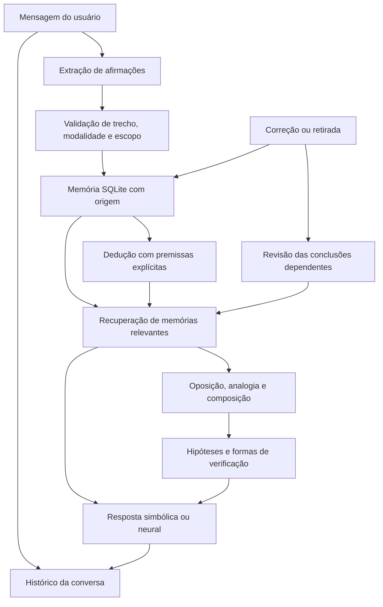

# Arquitetura do chatbot

> Este documento descreve a implementação atual, em que o modelo de linguagem ainda participa da extração e da resposta geral. A arquitetura pretendida, com processamento próprio da questão e raciocínio antes da redação pelo Qwen, está planejada no [TODO principal](../TODO.md). Os itens desse plano ainda precisam ser implementados e avaliados.

## Objetivo e alcance

Transformar experiências de conversa em conhecimento reutilizável e em propostas que possam ser revistas. O chatbot é o novo laboratório do projeto: o domínio não está limitado a pássaros e os dados do protótipo de visão não são carregados no seu banco.

O núcleo implementa memória persistente e regras de inferência explícitas. Um modelo neural de uso geral é o interlocutor principal. A mensagem atual determina a resposta; o histórico da conversa resolve referências e continuidade; as memórias estruturadas são apoio opcional. Essa divisão permite observar quais conclusões dependem de conhecimentos ensinados durante o uso, sem atribuir ao aprendizado recente aquilo que já estava no treinamento do modelo.



A resposta do assistente vai para o histórico. **Não existe uma seta que transforme automaticamente essa resposta em evidência factual.**

## Representação e origem

Uma afirmação é representada por sujeito, relação, objeto, polaridade e escopo. Por exemplo:

```text
M1: cristal — emite — luz      [universal, informado pelo usuário]
M2: neral   — é     — cristal  [instância, informado pelo usuário]
M3: neral   — emite — luz      [dedução; depende de M1 e M2]
```

Os textos são normalizados para comparação, inclusive removendo acentos dos conceitos. A mensagem e a citação de origem preservam o texto original. Uma frase genérica como “um cristal emite luz” não vira uma regra para todos os cristais: no extrator local, a universalidade exige `todo`, `toda` ou `cada`.

| Estado | Significado e uso |
| --- | --- |
| `asserted` | Informado pelo usuário; pode ser usado como premissa, sem alegação de verificação externa. |
| `deduced` | Conclusão condicional apoiada em premissas ativas e regra de dedução. |
| `hypothesis` | Proposta incerta, do usuário ou do motor; não fundamenta deduções factuais. |
| `disputed` | Afirmação em conflito; seu uso como premissa fica suspenso. |
| `retracted` | Retirada explicitamente ou por perda de uma premissa; permanece na trilha de auditoria. |

`sources` relaciona afirmações a mensagens do usuário e a trechos literais. `dependencies` registra as premissas das conclusões. `events` registra aprendizado, inferências, conflitos e retiradas. Uma conclusão pode passar a ter apoio direto se o usuário a afirmar explicitamente; isso representa uma nova fonte humana, não confirmação científica.

## Ciclo de uma interação

1. Validar o pedido e verificar se o identificador de envio já foi processado.
2. Recuperar o histórico e o referente recente da própria conversa.
3. Extrair afirmações localmente e, quando necessário, com JSON estruturado do modelo neural. Perguntas e comandos reconhecidos não exigem essa segunda chamada. Validar trechos e rejeitar saídas sem apoio textual, perguntas, instruções e modalidades indevidamente omitidas.
4. Registrar a mensagem e integrar afirmações, correções e conflitos.
5. Aplicar deduções por pertencimento a uma classe e por regras universais explícitas. O ciclo é limitado a quatro passagens e até 32 propostas por passagem.
6. Recuperar memórias por correspondência de conceitos e cobertura lexical, incluindo suporte às conclusões selecionadas. Um conceito explicitamente solicitado precisa estar representado na memória candidata: compartilhar apenas “buraco” ou “banco” não basta para confundir conceitos compostos diferentes. Priorizar fontes da conversa atual. O mecanismo ainda não usa embeddings.
7. Executar a exploração solicitada: oposição, analogia ou composição. Guardar as propostas com suas premissas e sua condição de hipótese.
8. Enviar histórico em mensagens nativas `user`/`assistant`, preservando turnos já respondidos, seguido da última mensagem do usuário. Incluir memória compacta como contexto auxiliar e gerar uma resposta direta ao pedido, usando conhecimento geral quando necessário. Transmitir o texto progressivamente, registrar os metadados e confirmar a transação.

O mesmo identificador de envio retorna o mesmo resultado, sem aprender duas vezes. Uma falha inesperada ou na geração reverte o turno inteiro e exibe um erro para permitir reenvio. Falha na extração adicional não desativa a conversa neural. A trava local e a transação serializam os turnos, inclusive durante chamadas ao modelo; essa implementação prioriza consistência de um laboratório pessoal e pode bloquear outras leituras enquanto o modelo responde.

`/api/chat/stream` transmite eventos NDJSON de texto e conclusão. O navegador exibe o texto durante a geração, e o servidor só informa sucesso após a persistência. A desconexão do navegador não cancela um turno já iniciado; o mesmo identificador permite recuperar seu resultado. Uma resposta parcial do provedor sem evento de conclusão gera erro. O histórico permanece separado por conversa, limitado a 24 mil caracteres recentes no contexto do modelo; isso não implica lembrança ilimitada de um diálogo longo.

## Como o raciocínio funciona

**Dedução:** se o usuário informa “Todo C possui P” e “X é C”, aplica P a X. A conclusão depende de ambas as premissas. Não há lógica de primeira ordem geral, quantificação existencial, raciocínio causal ou solução geral de contradições.

**Oposição:** inverte uma relação usando pares linguísticos iniciais ou pares ensinados com “O oposto de A é B”. Pode inverter palavras do nome ou propor “contraparte de X”. Inverter uma função gera uma possibilidade conceitual; não implica que todo fenômeno tenha um oposto realizável, nem que a entidade exista.

**Analogia:** procura entidades que compartilham relações e sugere testar uma propriedade adicional de uma delas na outra. Cada proposta referencia a propriedade transferida e as relações compartilhadas nas duas entidades. Uma afirmação negativa explícita bloqueia uma transferência incompatível. Não há garantia de equivalência estrutural profunda ou causal.

**Composição:** combina funções de dois ou três sujeitos relevantes em uma proposta de sistema e sugere verificar suas interfaces, compatibilidade e efeitos. A versão simbólica gera uma composição funcional simples; não sintetiza um projeto de engenharia nem mede sua novidade. O modelo neural pode desenvolver a apresentação da ideia, mas isso não a valida.

## Revisão e contradições

“Corrigindo: ...” substitui afirmações ativas com o mesmo sujeito, relação e escopo. A substituição não é limitada ao mesmo objeto: “Corrigindo: Neral absorve luz” pode substituir a relação anterior “Neral absorve energia”. Fora de uma correção explícita, uma relação pode ter vários objetos. É uma convenção do protótipo; para mudanças ambíguas, retire o conhecimento específico pelo painel.

A perda de uma premissa invalida as conclusões dependentes em cascata. Conclusões com nova evidência podem ser deduzidas novamente. Retiradas explícitas são respeitadas e não reaparecem pela mera repetição da mesma pergunta. Repetir uma hipótese não aumenta sua autoridade. Tornar incerta uma premissa antes afirmada também revisa as deduções dependentes.

Contradições detectadas são polaridades opostas da mesma relação e objeto, ou conclusões de regras universais incompatíveis com uma afirmação específica. Incompatibilidades semânticas como dois locais mutuamente exclusivos ainda exigem regras adicionais. O histórico não é reescrito: o painel e os cartões de evidência apresentam o estado atual; o modelo recebe também uma lista limitada de conhecimentos retirados.

## Provedores neurais

O adaptador Ollama usa `/api/chat`, `format` com JSON Schema para extração e streaming para respostas da interface. O adaptador OpenAI usa `/v1/responses`, `text.format` com esquema estrito, eventos de resposta e `store: false`. Esse último parâmetro não substitui a política de tratamento de dados do provedor. A chave é lida somente de `OPENAI_API_KEY` no processo servidor. O histórico é enviado com seus papéis nativos em ambos os provedores, em vez de ser serializado junto com a pergunta em um único bloco JSON.

O modelo local instalado pelo projeto é `qwen3.5:9b`. `scripts/setup_local_model.py` prepara runtime e pesos. `runtime.py` inicia apenas o executável local conhecido e somente para o endereço local padrão, aproveitando um servidor que já esteja ativo. A aplicação encerra apenas os processos que ela própria iniciou. O instalador não altera a configuração para o novo modelo se o download falhar.

As mensagens, o referente e, para a resposta, o contexto selecionado são enviados ao provedor configurado. O prompt distingue conhecimentos do treinamento do modelo, premissas do usuário, deduções e hipóteses. Saídas malformadas são rejeitadas; os filtros textuais reduzem erros de extração, mas não provam que uma frase foi semanticamente interpretada corretamente. A qualidade precisa ser medida com o modelo escolhido.

Referências de implementação: [API de chat do Ollama](https://docs.ollama.com/api/chat), [Structured Outputs do Ollama](https://docs.ollama.com/capabilities/structured-outputs), [Structured Outputs da OpenAI](https://developers.openai.com/api/docs/guides/structured-outputs) e [Responses API](https://developers.openai.com/api/reference/typescript/resources/responses/methods/create).

## Validação e limites

A suíte `tests/chat` usa bancos temporários, conceitos fictícios e servidores HTTP locais. Verifica aprendizado, correções, contexto, mudança de assunto e streaming. Os testes unitários dos provedores usam respostas simuladas. `scripts/evaluate_conversation.py` registra separadamente respostas de um modelo real para revisão qualitativa, com latência e memórias recuperadas. O modelo local já foi exercitado com perguntas gerais, referências à última resposta, mudança de assunto, resumo e código; isso não constitui uma avaliação ampla de sua confiabilidade.

O aprendizado atual altera memória e relações, não os pesos do modelo. A recuperação lexical, os verbos conhecidos pelo extrator simbólico, a leitura de toda a memória e o número limitado de passagens restringem cobertura e escala. Não há ainda avaliação de novidade, causalidade, aprendizagem de novas regras lógicas, verificador científico, treinamento incremental ou comparação experimental com um LLM sem memória. O [roteiro](CHATBOT_ROADMAP.md) define essas próximas etapas sem presumir resultados.
