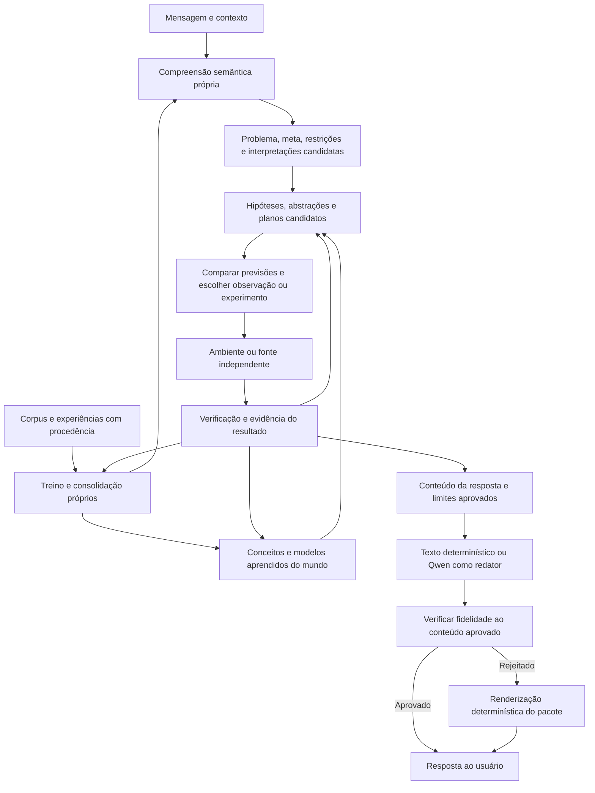

# Plano para o objetivo de raciocínio, aprendizado e invenção

Revisão de planejamento de 12/09/2026. Este documento orienta o [TODO](../TODO.md) e corrige a diferença entre os protótipos entregues e o objetivo do produto. Não é evidência de capacidades já adquiridas nem uma receita garantida para inteligência geral. As fases novas permanecem abertas.

## 1. A lacuna do planejamento anterior

F00–F11 entregaram infraestrutura e experimentos delimitados. O aceite de um experimento pode incluir um resultado negativo. Isso não satisfaz automaticamente a capacidade desejada no título da fase. A F12 reconheceu lacunas, mas seus seis itens ainda precisavam de dados, métodos, dependências e critérios de conclusão concretos.

| Evidência atual | Interpretação sustentada | O que permanece sem demonstração |
| --- | --- | --- |
| Pacote semântico anterior ao Qwen; regressões independentes | Independência do redator nos fluxos avaliados | Compreensão ampla de linguagem e conhecimento geral |
| MLP de intenção próprio, 58–68% nos 50 casos de avaliação por semente; não adotado para decidir a semântica | Um aprendiz pequeno foi treinado e avaliado | Um modelo que compreende relações, condições e argumentos variados |
| Coeficientes aprendidos em famílias fornecidas | Aprendizado numérico delimitado | Descoberta de estruturas e representações não fornecidas |
| Oposição, analogia e composição programadas | Geração rastreável de candidatos | Aprender a construir operadores de raciocínio novos |
| Planos numa linguagem numérica fixa e cadeias de conversão | Composição verificada dentro dessa linguagem | Invenções úteis além dos mecanismos já representados |
| Memória e piloto com identidade da tarefa fornecida | Registro, revisão e retenção no protocolo | Aprender continuamente numa conversa que muda de domínio sem aviso |
| 286 testes e 240 verificações de diálogos conhecidos | Correção de software e regressão | Generalização científica ou equivalência ao raciocínio humano |

Fontes locais: [resultados cognitivos](research/COGNITION_RESULTS.md), [aprendizado contínuo](research/MEMORY_LEARNING_OPERATIONS.md), [QA](research/F01_F11_QA.md) e [revisão conversacional](research/CONVERSATIONAL_REASONING_REVIEW.md). Essas evidências históricas serão preservadas.

## 2. O objetivo precisa de três níveis de aceite

**Produto conversacional:** compreender mensagens e contexto, responder à entidade e ao objetivo corretos, usar conhecimento com procedência e comunicar conclusões, hipóteses e lacunas de forma útil. Linguagem natural deve acionar capacidades do núcleo sem exigir que o usuário conheça comandos internos ou forneça a solução.

**Capacidade de aprender e raciocinar:** após experiências limitadas, o estado aprendido deve causar melhoria em problemas novos, além do que memória ou regras fixas conseguem com a mesma informação e recursos. Isso inclui descobrir relações, reaproveitar abstrações, selecionar observações e preservar conhecimentos anteriores. O conhecimento prévio e o custo para obtê-lo entram na comparação.

**Contribuição científica ou técnica:** produzir um artefato útil, atender restrições, superar um comparador pertinente, analisar trabalhos existentes e sobreviver a teste independente. Novidade em relação ao histórico do sistema, novidade na avaliação e novidade para a ciência são alegações diferentes.

“Einstein e Hawking multiplicados por 1.000” é uma ambição, não uma métrica atualmente definida. Poderemos medir tempo, custo e qualidade por resultado validado em tarefas delimitadas. Não atribuir um multiplicador de inteligência a quantidade de ideias, velocidade de texto ou número de testes aprovados. Não há garantia oferecida aqui de atingir capacidade científica geral; cada avanço dependerá de evidência.

## 3. Arquitetura proposta e hipóteses de pesquisa

A proposta é combinar representações aprendidas, memória estruturada, busca de hipóteses e verificadores. Essa é uma hipótese arquitetural a comparar com alternativas mais simples; usar uma rede neural ou um grafo, por si só, não encerra um requisito de capacidade.

Bibliotecas de subprocedimentos, modelos latentes e políticas aprendidas são técnicas candidatas. Podem ser substituídas ou descartadas após comparação experimental; o aceite da capacidade depende do comportamento, da contribuição aprendida e do custo, não de adotar uma arquitetura específica.

O modelo próprio de linguagem deve aprender semântica, e não apenas classificar a intenção. Ele propõe entidades, relações, condições, referências, metas e interpretações alternativas. O núcleo seleciona e testa essas representações antes de responder. Estados latentes aprendidos podem participar, desde que o projeto consiga avaliar sua contribuição e distinguir evidência de representação interna.

O contrato atual do Qwen continua restrito à organização dos trechos aprovados. Redação mais livre exige uma verificação adequada de fidelidade, incluindo negações, fontes, valores e grau de certeza; produzir um pacote antes da chamada não basta para garantir que o texto o preserve.

“Próprio” significa que as decisões semânticas, o aprendizado e os mecanismos de inferência pertencem ao núcleo. Se a exigência é treinar os modelos desde a inicialização, serão necessários corpus, tokenização, arquitetura, objetivos de treino, pesos, otimização e avaliação próprios. Bibliotecas de tensores, bancos e métodos publicados podem ser usados e declarados. Pesos gerais importados ou dados gerados por outro modelo precisam de procedência explícita; não podem ser apresentados como ausência de conhecimento prévio. O plano mantém Qwen fora da compreensão, escolha de evidências e inferência.

## 4. O que precisa ser construído

| Frente | Entrega necessária | Evidência para avançar | Fases |
| --- | --- | --- | --- |
| Dados e aprendizagem de linguagem | Corpus diversificado, curadoria, rótulos semânticos e modelos próprios | Entidades, relações, negações e contexto corretos em estruturas e autores fora do treino | F13–F14 |
| Conhecimento e representação do mundo | Conceitos, tipos, estados, ações, unidades, condições, fontes e incerteza | Previsões verificáveis e revisão correta em contextos novos | F15 |
| Descoberta de regras e abstrações | Indução de estrutura, biblioteca de operadores aprendidos e transferência | Ganho causado pelo estado aprendido em famílias novas, incluindo ablação sem esse estado | F16 |
| Causalidade e investigação | Múltiplas explicações e escolha de experimentos que as diferenciem | Previsões de intervenções e redução de incerteza frente a controles | F17 |
| Criação e invenção | Busca de projetos, programas ou mecanismos sob metas e restrições | Artefato executável, diversidade funcional, utilidade e robustez | F18 |
| Aprendizado contínuo e metacognição | Memória imediata, consolidação, detecção de mudança, retenção e incerteza calibrada | Melhoria futura com pouca experiência sem deterioração indevida ou certeza artificial | F19 |
| Física e quântica | Modelos quantitativos, medições e comparação de mecanismos | Validade no domínio e, para alegar vantagem, resultado superior ao comparador adequado | F20 |
| Integração e pesquisa independente | Todos os mecanismos acessíveis pelo chat, avaliação de uso e replicação | Ganho em tarefas reservadas e contribuição delimitada validada externamente | F21 |

Um chat com pouco conhecimento não pode obter conhecimento geral apenas combinando as frases de uma conversa. Precisamos de educação inicial do sistema: linguagem, matemática, informações de domínio e experiências, com procedência e controle de contaminação. Poucos exemplos de uma tarefa nova não significam pouca experiência total. A proposta de avaliar aquisição de competência contabilizando experiência e pressupostos é discutida por [Chollet](https://arxiv.org/abs/1911.01547).

Para aprender novos recursos de raciocínio, uma linha candidata é inferir programas e abstrações reutilizáveis, com modelos neurais guiando a busca. [DreamCoder](https://arxiv.org/abs/2006.08381) demonstra esse tipo de combinação em domínios delimitados; é uma referência de pesquisa, não uma implementação já presente neste projeto nem prova de suficiência para o objetivo geral.

Modelos aprendidos usados no planejamento também têm precedente experimental, como [MuZero](https://www.nature.com/articles/s41586-020-03051-4) em jogos. A aplicação que propomos a modelos causais, linguagem e invenção exige avaliação própria; resultados em jogos não transferem automaticamente para descoberta científica.

## 5. O que significa aprender a cada interação

Cada interação deve ser processada como oportunidade de aprendizado. Isso não implica aceitar cada frase como verdade ou modificar todos os pesos imediatamente.

1. Registrar o episódio e atualizar o contexto, preservando se é pergunta, hipótese, observação ou correção.
2. Confrontar a informação com o conhecimento e as previsões anteriores; identificar o que ela sustenta, contradiz ou deixa indeterminado.
3. Atualizar memória e candidatos quando houver suporte; distinguir novidade de repetição e independência de fontes.
4. Selecionar experiências para atualização de modelos, regras e estratégias; avaliar ganho e retenção antes de promover a versão.
5. Testar se a experiência realmente melhorou o desempenho posterior. Uma interação pode confirmar algo, exigir esclarecimento ou não justificar mudança persistente.

A retenção do que já foi aprendido e a capacidade de continuar aprendendo são problemas diferentes. [Dohare e colaboradores](https://www.nature.com/articles/s41586-024-07711-7) observaram perda de plasticidade em suas sequências de aprendizado e avaliaram uma intervenção para reduzi-la. Isso justifica medir ambos no projeto; não fornece uma solução universal para conversas abertas.

## 6. Física e mecânica quântica: função e limite

Física é necessária para propostas sobre fenômenos físicos: unidades, conservação, dinâmica, condições iniciais, perdas, escalas, interfaces e medições restringem o que pode funcionar. Um simulador ajuda a testar um modelo; precisamos também verificar se o modelo representa o fenômeno relevante.

Há três linhas diferentes: **raciocinar sobre sistemas quânticos**, **usar modelos matemáticos quânticos para hipóteses sobre cognição** e **usar computação quântica como recurso de cálculo**. Ter sucesso numa delas não demonstra as outras. Simular estados quânticos em software não comprova uma reprodução do pensamento humano ou vantagem computacional.

A inclusão de um componente quântico exige tarefa, mecanismo, previsão e comparadores clássicos com informação e orçamento pertinentes. [Huang e colaboradores](https://arxiv.org/abs/2011.01938) mostram por que dados e comparadores clássicos podem alterar uma alegação de vantagem quântica. Um componente proposto para melhorar desempenho depende dessa evidência para ser promovido. Um simulador pode permanecer útil pela fidelidade a um fenômeno quântico, sem alegar vantagem de aprendizagem ou custo. Nenhum deles será uma dependência obrigatória para toda inferência do chat.

O exemplo do buraco branco ilustra a diferença entre propor uma hipótese por inversão e demonstrar um fenômeno. A descrição de uma entidade, isoladamente, não estabelece a existência de uma contraparte física. Para avançar, o núcleo precisa construir uma hipótese coerente, deduzir consequências e confrontá-las com teoria e evidência. “Adivinhar” deve significar uma previsão incerta avaliável, não uma afirmação confiante sem suporte.

## 7. Primeiro marco de capacidade que falta

**M1 — Aprender um mecanismo desconhecido e utilizá-lo em uma tarefa nova pelo chat.** O desenho definitivo será registrado em F13 antes do uso do novo conjunto de avaliação. Proposta inicial:

- Mundos de dispositivos com objetos, estados, ações e condições; o avaliador conhece o mecanismo, o aprendiz recebe somente observações permitidas.
- Avaliar curvas com 1, 2, 4, 8 e 16 exemplos por tarefa, contando toda a experiência prévia. Variar estruturas e famílias; trocar nomes é apenas um controle adicional.
- Pedir uma previsão e um plano para atingir uma meta não demonstrada. A regra final não aparece na mensagem, na gramática de extração nem nas respostas de um modelo externo.
- Incluir mecanismos indistinguíveis nas primeiras observações. O sistema deve escolher uma observação informativa ou declarar a indeterminação, com orçamento igual ao dos controles.
- Introduzir contraprova, ruído e mudança de contexto; exigir revisão e medir preservação de competências anteriores.
- Comparar memória, regras fixas, aprendiz simples e modelo proposto. Retirar o estado aprendido deve eliminar o ganho que lhe atribuímos. Testar também sem Qwen e com variações de redação.

Esse marco não está alcançado pelo piloto afim: parte essencial da nova avaliação é descobrir estrutura além dos coeficientes de uma família fornecida. A linguagem de hipóteses inicial precisa ser declarada; nenhum sistema aprende literalmente sem pressupostos. A ampliação dessa linguagem por experiência será uma alegação separada e testada na F16.

Depois: **M2**, demonstrar reaproveitamento de abstrações e aprendizado contínuo; **M3**, obter uma invenção útil validada em domínio físico delimitado; **M4**, replicar uma contribuição em domínio novo e ampliar competência sem perder a anterior. Cada marco pode exigir revisar a arquitetura; o plano não presume êxito.

## 8. Recursos, responsabilidades e ordem

F13 prepara o contrato, o corpus de avaliação e um perfil medido de custo. F14/F15 fornecem compreensão e representação; F16-01 a F16-05 fornecem candidatos à F17, que executa investigação discriminante. A integração permite avaliar M1 em F16-06. F18 usa esses recursos para invenção. F19 e F21 integram e avaliam continuamente. F20 participa desde o desenho de tarefas físicas e quânticas, sem bloquear os domínios que não dependem dele.

Precisamos cobrir competências de engenharia de aprendizagem, linguagem, representação, indução, causalidade, estatística, sistemas e domínio científico. Agentes desenvolvedores, QA e revisor podem acelerar implementação e crítica, mas compartilham contexto e infraestrutura; sua concordância não equivale a uma observação independente ou revisão humana por pares. Antes de alegar contribuição científica, precisamos de avaliação de domínio e replicação pertinente; eventuais contatos externos dependem de autorização do usuário.

Precisamos também de dados licenciados e anotação, armazenamento versionado, tempo de experimentação e capacidade de treinamento. O computador local serve como ponto de partida para medir modelos pequenos. Quantidade de parâmetros, volume de dados, GPUs, custo e prazo serão estimados após perfil e curvas de ganho; não há compra ou contratação prevista por esta revisão. Mais computação só será considerada se o mecanismo demonstrar utilidade e seu gargalo estiver identificado.

## 9. Regra de aceite para evitar outro fechamento prematuro

Manter três registros: **entrega de engenharia**, **capacidade demonstrada** e **contribuição científica**. Um PASS no primeiro não marca os outros. Uma pesquisa concluída com resultado negativo é uma entrega, não uma capacidade conquistada.

Cada alegação precisa de: domínio e cobertura, experiência prévia, hipótese falsificável, comparadores, custo total, tamanho e separação das amostras, métricas e limiares registrados antes de avaliar, fontes e versões, resultados positivos e negativos e avaliação independente. Os limiares novos ainda precisam ser definidos em F13; não foram registrados retroativamente por este documento.

Dados já vistos pelos desenvolvedores permanecem desenvolvimento/regressão. Em avaliação reservada, separar famílias, estruturas, templates e fontes, controlar contaminação e manter os autores sem acesso aos exemplos até congelar o candidato. Um agente que leu um conjunto não pode chamá-lo de cego para si. Acesso ao mecanismo oculto pelo avaliador nunca deve vazar ao aprendiz.

O progresso será apresentado por esses marcos e suas evidências, sem porcentagem de inteligência baseada em caixas concluídas. Este plano cobre as frentes hoje identificadas; a pesquisa pode revelar novas lacunas. Nenhuma lista de tarefas pode garantir de antemão o resultado científico geral pretendido.
